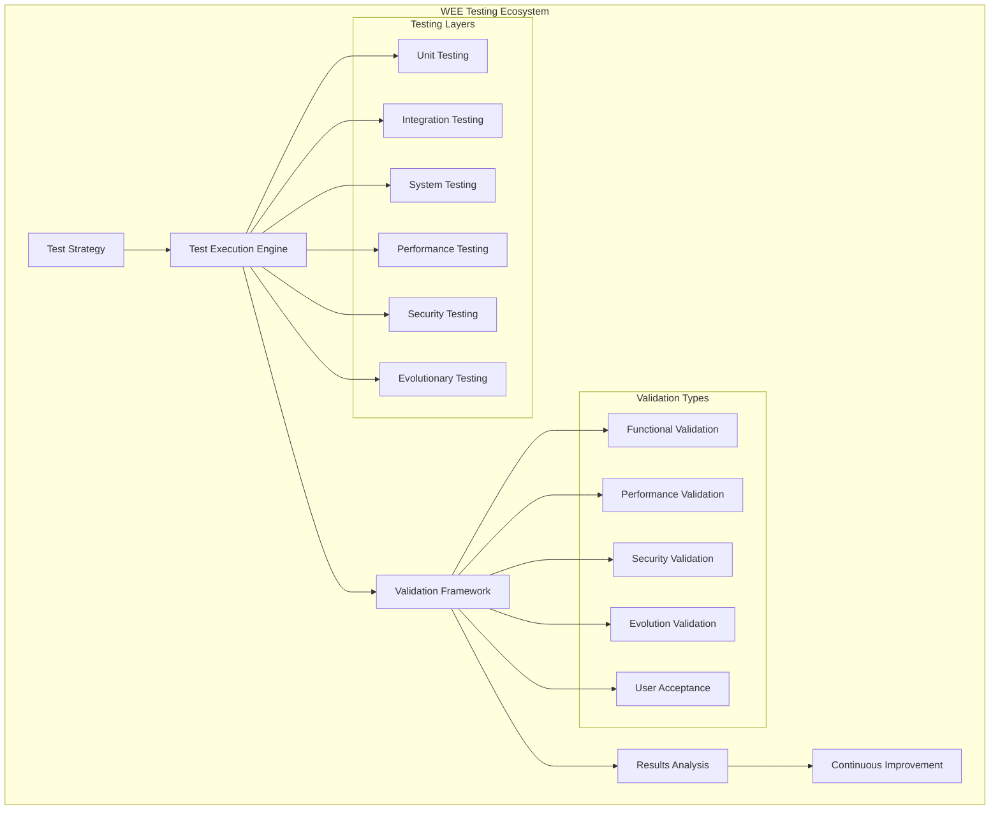

# WEE Testing & Validation Framework

## ⚡ Testing Strategy by Edison (Dev Agent)

*"Like Edison's systematic approach to testing thousands of materials for the light bulb filament, this testing framework validates every aspect of WEE's evolutionary capabilities through persistent experimentation and iterative improvement."*

## Testing Architecture Overview



---

## Core Testing Framework

### 1. Evolutionary Testing Engine

#### 1.1 Adaptive Test Generation
```typescript
class WEEEvolutionaryTestEngine {
  private testGenerator: AdaptiveTestGenerator;
  private evolutionValidator: EvolutionValidator;
  private fitnessEvaluator: TestFitnessEvaluator;
  private testOptimizer: TestOptimizer;
  
  // Generate tests that evolve with the system
  async generateEvolutionaryTests(systemState: SystemState): Promise<EvolutionaryTestSuite> {
    // Analyze current system behavior
    const behaviorAnalysis = await this.analyzeBehaviorPatterns(systemState);
    
    // Generate adaptive test cases
    const adaptiveTests = await this.testGenerator.generateAdaptiveTests(behaviorAnalysis);
    
    // Create evolutionary test scenarios
    const evolutionaryScenarios = await this.createEvolutionaryScenarios(adaptiveTests);
    
    // Optimize test coverage
    const optimizedTests = await this.testOptimizer.optimizeTestCoverage(evolutionaryScenarios);
    
    // Validate evolutionary behavior
    const validationTests = await this.evolutionValidator.createValidationTests(optimizedTests);
    
    return new EvolutionaryTestSuite(optimizedTests, validationTests, behaviorAnalysis);
  }
  
  // Test system evolution capabilities
  async testEvolutionCapabilities(evolutionEngine: EvolutionEngine): Promise<EvolutionTestResult> {
    // Test learning rate validation
    const learningTests = await this.testLearningCapabilities(evolutionEngine);
    
    // Test adaptation speed
    const adaptationTests = await this.testAdaptationSpeed(evolutionEngine);
    
    // Test pattern recognition accuracy
    const patternTests = await this.testPatternRecognition(evolutionEngine);
    
    // Test evolutionary algorithm effectiveness
    const algorithmTests = await this.testEvolutionaryAlgorithms(evolutionEngine);
    
    // Evaluate overall fitness
    const overallFitness = await this.fitnessEvaluator.evaluateEvolutionFitness([
      learningTests,
      adaptationTests,
      patternTests,
      algorithmTests
    ]);
    
    return new EvolutionTestResult(learningTests, adaptationTests, patternTests, algorithmTests, overallFitness);
  }
  
  // Validate evolutionary improvements
  async validateEvolutionaryImprovement(before: SystemMetrics, after: SystemMetrics): Promise<ImprovementValidation> {
    // Measure performance improvements
    const performanceImprovement = await this.measurePerformanceImprovement(before, after);
    
    // Validate learning effectiveness
    const learningEffectiveness = await this.validateLearningEffectiveness(before, after);
    
    // Check adaptation quality
    const adaptationQuality = await this.checkAdaptationQuality(before, after);
    
    // Assess regression risks
    const regressionRisks = await this.assessRegressionRisks(before, after);
    
    // Generate improvement report
    const report = await this.generateImprovementReport(
      performanceImprovement,
      learningEffectiveness,
      adaptationQuality,
      regressionRisks
    );
    
    return new ImprovementValidation(report, performanceImprovement, learningEffectiveness);
  }
}
```

### 2. Intelligent Test Case Generation

#### 2.1 AI-Powered Test Creation
```typescript
class WEEIntelligentTestGenerator {
  private codeAnalyzer: CodeAnalyzer;
  private requirementAnalyzer: RequirementAnalyzer;
  private patternMatcher: TestPatternMatcher;
  private aiTestGenerator: AITestGenerator;
  
  // Generate comprehensive test suites using AI
  async generateIntelligentTests(codebase: Codebase, requirements: Requirements): Promise<IntelligentTestSuite> {
    // Analyze code structure and complexity
    const codeAnalysis = await this.codeAnalyzer.analyzeCodeStructure(codebase);
    
    // Extract testable requirements
    const testableRequirements = await this.requirementAnalyzer.extractTestableRequirements(requirements);
    
    // Identify test patterns
    const testPatterns = await this.patternMatcher.identifyTestPatterns(codeAnalysis);
    
    // Generate AI-assisted test cases
    const aiGeneratedTests = await this.aiTestGenerator.generateTests(
      codeAnalysis,
      testableRequirements,
      testPatterns
    );
    
    // Create edge case tests
    const edgeCaseTests = await this.generateEdgeCaseTests(codeAnalysis);
    
    // Generate boundary value tests
    const boundaryTests = await this.generateBoundaryTests(codeAnalysis);
    
    // Create performance tests
    const performanceTests = await this.generatePerformanceTests(codeAnalysis);
    
    return new IntelligentTestSuite(
      aiGeneratedTests,
      edgeCaseTests,
      boundaryTests,
      performanceTests,
      testPatterns
    );
  }
  
  // Adaptive test case optimization
  async optimizeTestCases(testSuite: TestSuite, executionHistory: TestExecutionHistory): Promise<OptimizedTestSuite> {
    // Analyze test effectiveness
    const effectiveness = await this.analyzeTestEffectiveness(testSuite, executionHistory);
    
    // Identify redundant tests
    const redundantTests = await this.identifyRedundantTests(testSuite, effectiveness);
    
    // Optimize test execution order
    const optimizedOrder = await this.optimizeExecutionOrder(testSuite, executionHistory);
    
    // Generate additional coverage tests
    const coverageTests = await this.generateCoverageTests(testSuite, effectiveness);
    
    // Create optimized test suite
    const optimized = await this.createOptimizedSuite(
      testSuite,
      redundantTests,
      optimizedOrder,
      coverageTests
    );
    
    return new OptimizedTestSuite(optimized, effectiveness, redundantTests);
  }
}
```

### 3. Multi-Layer Testing Strategy

#### 3.1 Unit Testing Framework
```typescript
class WEEUnitTestingFramework {
  private testRunner: AdaptiveTestRunner;
  private mockManager: IntelligentMockManager;
  private assertionEngine: SmartAssertionEngine;
  private coverageAnalyzer: CoverageAnalyzer;
  
  // Intelligent unit test execution
  async executeUnitTests(testSuite: UnitTestSuite): Promise<UnitTestResult> {
    // Set up intelligent mocking
    const mockSetup = await this.mockManager.setupIntelligentMocks(testSuite);
    
    // Execute tests with adaptive strategies
    const executionResult = await this.testRunner.executeAdaptively(testSuite, mockSetup);
    
    // Analyze test coverage
    const coverage = await this.coverageAnalyzer.analyzeCoverage(executionResult);
    
    // Generate smart assertions validation
    const assertionValidation = await this.assertionEngine.validateAssertions(executionResult);
    
    // Identify test improvements
    const improvements = await this.identifyTestImprovements(executionResult, coverage);
    
    return new UnitTestResult(executionResult, coverage, assertionValidation, improvements);
  }
  
  // Mutation testing for test quality
  async performMutationTesting(codebase: Codebase, testSuite: UnitTestSuite): Promise<MutationTestResult> {
    // Generate code mutations
    const mutations = await this.generateCodeMutations(codebase);
    
    // Execute tests against mutations
    const mutationResults = await Promise.all(
      mutations.map(mutation => this.testRunner.executeAgainstMutation(testSuite, mutation))
    );
    
    // Calculate mutation score
    const mutationScore = await this.calculateMutationScore(mutationResults);
    
    // Identify weak tests
    const weakTests = await this.identifyWeakTests(mutationResults);
    
    // Generate improvement recommendations
    const recommendations = await this.generateTestImprovementRecommendations(weakTests);
    
    return new MutationTestResult(mutationScore, weakTests, recommendations, mutationResults);
  }
}
```

#### 3.2 Integration Testing Framework
```typescript
class WEEIntegrationTestingFramework {
  private serviceOrchestrator: ServiceOrchestrator;
  private dataFlowValidator: DataFlowValidator;
  private contractTester: ContractTester;
  private environmentManager: TestEnvironmentManager;
  
  // Comprehensive integration testing
  async executeIntegrationTests(integrationSuite: IntegrationTestSuite): Promise<IntegrationTestResult> {
    // Set up test environment
    const environment = await this.environmentManager.setupIntegrationEnvironment(integrationSuite);
    
    // Orchestrate service interactions
    const serviceInteractions = await this.serviceOrchestrator.orchestrateServices(integrationSuite);
    
    // Validate data flow between components
    const dataFlowValidation = await this.dataFlowValidator.validateDataFlow(serviceInteractions);
    
    // Test service contracts
    const contractValidation = await this.contractTester.validateContracts(serviceInteractions);
    
    // Test error propagation
    const errorPropagation = await this.testErrorPropagation(serviceInteractions);
    
    // Validate transaction consistency
    const transactionConsistency = await this.validateTransactionConsistency(serviceInteractions);
    
    return new IntegrationTestResult(
      serviceInteractions,
      dataFlowValidation,
      contractValidation,
      errorPropagation,
      transactionConsistency
    );
  }
  
  // API contract testing
  async performContractTesting(apiContracts: APIContract[]): Promise<ContractTestResult> {
    const contractResults = await Promise.all(
      apiContracts.map(async contract => {
        // Validate request/response schemas
        const schemaValidation = await this.contractTester.validateSchema(contract);
        
        // Test API behavior
        const behaviorValidation = await this.contractTester.validateBehavior(contract);
        
        // Test backward compatibility
        const compatibilityValidation = await this.contractTester.validateCompatibility(contract);
        
        return {
          contract,
          schemaValidation,
          behaviorValidation,
          compatibilityValidation
        };
      })
    );
    
    return new ContractTestResult(contractResults);
  }
}
```

#### 3.3 System Testing Framework
```typescript
class WEESystemTestingFramework {
  private systemOrchestrator: SystemOrchestrator;
  private endToEndValidator: EndToEndValidator;
  private userJourneyTester: UserJourneyTester;
  private systemMonitor: SystemMonitor;
  
  // End-to-end system testing
  async executeSystemTests(systemTestSuite: SystemTestSuite): Promise<SystemTestResult> {
    // Initialize complete system
    const systemInitialization = await this.systemOrchestrator.initializeSystem(systemTestSuite);
    
    // Execute user journey tests
    const userJourneyResults = await this.userJourneyTester.executeUserJourneys(systemTestSuite);
    
    // Validate end-to-end workflows
    const endToEndValidation = await this.endToEndValidator.validateWorkflows(systemTestSuite);
    
    // Monitor system behavior
    const systemBehavior = await this.systemMonitor.monitorSystemBehavior(systemTestSuite);
    
    // Test system resilience
    const resilienceTests = await this.testSystemResilience(systemTestSuite);
    
    // Validate business scenarios
    const businessScenarios = await this.validateBusinessScenarios(systemTestSuite);
    
    return new SystemTestResult(
      userJourneyResults,
      endToEndValidation,
      systemBehavior,
      resilienceTests,
      businessScenarios
    );
  }
  
  // Chaos engineering for resilience testing
  async performChaosEngineering(system: System): Promise<ChaosTestResult> {
    // Define chaos experiments
    const chaosExperiments = await this.defineChaosExperiments(system);
    
    // Execute controlled failures
    const chaosResults = await Promise.all(
      chaosExperiments.map(experiment => this.executeChaosExperiment(experiment))
    );
    
    // Analyze system recovery
    const recoveryAnalysis = await this.analyzeSystemRecovery(chaosResults);
    
    // Identify resilience improvements
    const resilienceImprovements = await this.identifyResilienceImprovements(recoveryAnalysis);
    
    return new ChaosTestResult(chaosResults, recoveryAnalysis, resilienceImprovements);
  }
}
```

### 4. Performance Testing Framework

#### 4.1 Comprehensive Performance Validation
```typescript
class WEEPerformanceTestingFramework {
  private loadGenerator: IntelligentLoadGenerator;
  private performanceMonitor: PerformanceMonitor;
  private bottleneckAnalyzer: BottleneckAnalyzer;
  private scalabilityTester: ScalabilityTester;
  
  // Multi-dimensional performance testing
  async executePerformanceTests(performanceTestSuite: PerformanceTestSuite): Promise<PerformanceTestResult> {
    // Generate realistic load patterns
    const loadPatterns = await this.loadGenerator.generateRealisticLoad(performanceTestSuite);
    
    // Execute load tests
    const loadTestResults = await this.executeLoadTests(loadPatterns);
    
    // Execute stress tests
    const stressTestResults = await this.executeStressTests(performanceTestSuite);
    
    // Execute spike tests
    const spikeTestResults = await this.executeSpikeTests(performanceTestSuite);
    
    // Execute endurance tests
    const enduranceTestResults = await this.executeEnduranceTests(performanceTestSuite);
    
    // Analyze performance bottlenecks
    const bottleneckAnalysis = await this.bottleneckAnalyzer.analyzeBottlenecks([
      loadTestResults,
      stressTestResults,
      spikeTestResults,
      enduranceTestResults
    ]);
    
    // Test scalability characteristics
    const scalabilityAnalysis = await this.scalabilityTester.analyzeScalability(performanceTestSuite);
    
    return new PerformanceTestResult(
      loadTestResults,
      stressTestResults,
      spikeTestResults,
      enduranceTestResults,
      bottleneckAnalysis,
      scalabilityAnalysis
    );
  }
  
  // Predictive performance modeling
  async performPredictiveModeling(historicalData: PerformanceHistory): Promise<PerformancePrediction> {
    // Analyze performance trends
    const trends = await this.performanceMonitor.analyzeTrends(historicalData);
    
    // Build predictive models
    const models = await this.buildPerformanceModels(trends);
    
    // Predict future performance
    const predictions = await this.predictFuturePerformance(models);
    
    // Identify potential issues
    const potentialIssues = await this.identifyPotentialIssues(predictions);
    
    // Generate optimization recommendations
    const optimizations = await this.generateOptimizationRecommendations(potentialIssues);
    
    return new PerformancePrediction(predictions, potentialIssues, optimizations);
  }
}
```

### 5. Security Testing Framework

#### 5.1 Automated Security Validation
```typescript
class WEESecurityTestingFramework {
  private vulnerabilityScanner: VulnerabilityScanner;
  private penetrationTester: AutomatedPenTester;
  private securityValidator: SecurityValidator;
  private threatModeler: ThreatModeler;
  
  // Comprehensive security testing
  async executeSecurityTests(securityTestSuite: SecurityTestSuite): Promise<SecurityTestResult> {
    // Automated vulnerability scanning
    const vulnerabilityResults = await this.vulnerabilityScanner.scanForVulnerabilities(securityTestSuite);
    
    // Automated penetration testing
    const penTestResults = await this.penetrationTester.executePenTests(securityTestSuite);
    
    // Security configuration validation
    const configValidation = await this.securityValidator.validateSecurityConfiguration(securityTestSuite);
    
    // Authentication and authorization testing
    const authTestResults = await this.testAuthenticationAuthorization(securityTestSuite);
    
    // Data protection testing
    const dataProtectionResults = await this.testDataProtection(securityTestSuite);
    
    // Threat modeling validation
    const threatModelValidation = await this.threatModeler.validateThreatModel(securityTestSuite);
    
    return new SecurityTestResult(
      vulnerabilityResults,
      penTestResults,
      configValidation,
      authTestResults,
      dataProtectionResults,
      threatModelValidation
    );
  }
  
  // Security regression testing
  async performSecurityRegression(baseline: SecurityBaseline): Promise<SecurityRegressionResult> {
    // Compare current security posture to baseline
    const comparison = await this.securityValidator.compareToBaseline(baseline);
    
    // Identify security regressions
    const regressions = await this.securityValidator.identifyRegressions(comparison);
    
    // Validate security improvements
    const improvements = await this.securityValidator.validateImprovements(comparison);
    
    // Generate security trend analysis
    const trendAnalysis = await this.securityValidator.analyzeTrends(comparison);
    
    return new SecurityRegressionResult(regressions, improvements, trendAnalysis);
  }
}
```

---

## Test Data Management

### 1. Intelligent Test Data Generation

#### 1.1 Synthetic Data Generation
```typescript
class WEETestDataManager {
  private dataGenerator: SyntheticDataGenerator;
  private dataAnonymizer: DataAnonymizer;
  private dataValidator: TestDataValidator;
  private dataVersioner: TestDataVersioner;
  
  // Generate realistic test data
  async generateTestData(dataRequirements: DataRequirements): Promise<TestDataSet> {
    // Analyze data patterns
    const patterns = await this.dataGenerator.analyzeDataPatterns(dataRequirements);
    
    // Generate synthetic data
    const syntheticData = await this.dataGenerator.generateSyntheticData(patterns);
    
    // Ensure data privacy compliance
    const anonymizedData = await this.dataAnonymizer.anonymizeData(syntheticData);
    
    // Validate data quality
    const validation = await this.dataValidator.validateDataQuality(anonymizedData);
    
    // Version test data
    const versionedData = await this.dataVersioner.versionTestData(anonymizedData);
    
    return new TestDataSet(versionedData, validation, patterns);
  }
  
  // Dynamic test data adaptation
  async adaptTestData(testResults: TestResults, currentData: TestDataSet): Promise<AdaptedTestDataSet> {
    // Analyze test data effectiveness
    const effectiveness = await this.dataValidator.analyzeEffectiveness(testResults, currentData);
    
    // Identify data gaps
    const dataGaps = await this.dataValidator.identifyDataGaps(effectiveness);
    
    // Generate additional test data
    const additionalData = await this.dataGenerator.generateAdditionalData(dataGaps);
    
    // Optimize existing data
    const optimizedData = await this.dataGenerator.optimizeExistingData(currentData, effectiveness);
    
    return new AdaptedTestDataSet(optimizedData, additionalData, effectiveness);
  }
}
```

### 2. Test Environment Management

#### 2.1 Dynamic Environment Provisioning
```typescript
class WEETestEnvironmentManager {
  private environmentProvisioner: EnvironmentProvisioner;
  private configurationManager: ConfigurationManager;
  private environmentMonitor: EnvironmentMonitor;
  private resourceOptimizer: ResourceOptimizer;
  
  // Provision on-demand test environments
  async provisionTestEnvironment(requirements: EnvironmentRequirements): Promise<TestEnvironment> {
    // Analyze resource requirements
    const resourceAnalysis = await this.resourceOptimizer.analyzeRequirements(requirements);
    
    // Provision infrastructure
    const infrastructure = await this.environmentProvisioner.provisionInfrastructure(resourceAnalysis);
    
    // Configure environment
    const configuration = await this.configurationManager.configureEnvironment(infrastructure, requirements);
    
    // Validate environment readiness
    const validation = await this.environmentMonitor.validateEnvironment(configuration);
    
    // Set up monitoring
    const monitoring = await this.environmentMonitor.setupMonitoring(configuration);
    
    return new TestEnvironment(configuration, validation, monitoring);
  }
  
  // Environment health monitoring
  async monitorEnvironmentHealth(environment: TestEnvironment): Promise<EnvironmentHealthReport> {
    // Monitor resource utilization
    const resourceUtilization = await this.environmentMonitor.monitorResources(environment);
    
    // Check service health
    const serviceHealth = await this.environmentMonitor.checkServiceHealth(environment);
    
    // Validate configuration drift
    const configurationDrift = await this.configurationManager.checkConfigurationDrift(environment);
    
    // Analyze performance trends
    const performanceTrends = await this.environmentMonitor.analyzePerformanceTrends(environment);
    
    return new EnvironmentHealthReport(
      resourceUtilization,
      serviceHealth,
      configurationDrift,
      performanceTrends
    );
  }
}
```

---

## Test Automation Framework

### 1. Continuous Testing Pipeline

#### 1.1 CI/CD Integration
```typescript
class WEETestAutomationPipeline {
  private pipelineOrchestrator: PipelineOrchestrator;
  private testScheduler: IntelligentTestScheduler;
  private resultAnalyzer: TestResultAnalyzer;
  private qualityGateManager: QualityGateManager;
  
  // Intelligent test execution pipeline
  async executeContinuousTestingPipeline(codeChanges: CodeChanges): Promise<PipelineResult> {
    // Analyze code changes impact
    const impactAnalysis = await this.analyzeCodeChangeImpact(codeChanges);
    
    // Schedule relevant tests
    const testSchedule = await this.testScheduler.scheduleTests(impactAnalysis);
    
    // Execute tests in parallel
    const testResults = await this.pipelineOrchestrator.executeParallelTests(testSchedule);
    
    // Analyze test results
    const resultAnalysis = await this.resultAnalyzer.analyzeResults(testResults);
    
    // Evaluate quality gates
    const qualityGateResults = await this.qualityGateManager.evaluateQualityGates(resultAnalysis);
    
    // Generate deployment decision
    const deploymentDecision = await this.generateDeploymentDecision(qualityGateResults);
    
    return new PipelineResult(testResults, resultAnalysis, qualityGateResults, deploymentDecision);
  }
  
  // Adaptive test selection
  async selectOptimalTests(availableTests: TestSuite[], constraints: TestConstraints): Promise<OptimalTestSelection> {
    // Analyze test coverage and risk
    const coverageAnalysis = await this.analyzeTestCoverage(availableTests);
    
    // Assess test execution costs
    const costAnalysis = await this.analyzeTestCosts(availableTests);
    
    // Calculate risk-based test priorities
    const riskPriorities = await this.calculateRiskBasedPriorities(availableTests);
    
    // Optimize test selection
    const optimalSelection = await this.optimizeTestSelection(
      coverageAnalysis,
      costAnalysis,
      riskPriorities,
      constraints
    );
    
    return new OptimalTestSelection(optimalSelection, coverageAnalysis, riskPriorities);
  }
}
```

### 2. Test Results Analytics

#### 2.1 Intelligent Test Analytics
```typescript
class WEETestAnalytics {
  private analyticsEngine: TestAnalyticsEngine;
  private patternDetector: TestPatternDetector;
  private predictiveAnalyzer: PredictiveTestAnalyzer;
  private reportGenerator: TestReportGenerator;
  
  // Comprehensive test analytics
  async analyzeTestResults(testHistory: TestHistory): Promise<TestAnalyticsReport> {
    // Analyze test execution patterns
    const executionPatterns = await this.patternDetector.detectExecutionPatterns(testHistory);
    
    // Identify failure patterns
    const failurePatterns = await this.patternDetector.detectFailurePatterns(testHistory);
    
    // Analyze test effectiveness trends
    const effectivenessTrends = await this.analyticsEngine.analyzeEffectivenessTrends(testHistory);
    
    // Predict future test outcomes
    const predictions = await this.predictiveAnalyzer.predictTestOutcomes(testHistory);
    
    // Generate optimization recommendations
    const optimizations = await this.generateOptimizationRecommendations(
      executionPatterns,
      failurePatterns,
      effectivenessTrends
    );
    
    return new TestAnalyticsReport(
      executionPatterns,
      failurePatterns,
      effectivenessTrends,
      predictions,
      optimizations
    );
  }
  
  // Test quality metrics
  async calculateTestQualityMetrics(testSuite: TestSuite): Promise<TestQualityMetrics> {
    // Calculate test coverage metrics
    const coverage = await this.analyticsEngine.calculateCoverage(testSuite);
    
    // Assess test maintainability
    const maintainability = await this.analyticsEngine.assessMaintainability(testSuite);
    
    // Evaluate test reliability
    const reliability = await this.analyticsEngine.evaluateReliability(testSuite);
    
    // Measure test execution efficiency
    const efficiency = await this.analyticsEngine.measureEfficiency(testSuite);
    
    // Calculate overall quality score
    const qualityScore = await this.analyticsEngine.calculateQualityScore(
      coverage,
      maintainability,
      reliability,
      efficiency
    );
    
    return new TestQualityMetrics(coverage, maintainability, reliability, efficiency, qualityScore);
  }
}
```

---

## Validation Framework

### 1. Multi-Stakeholder Validation

#### 1.1 User Acceptance Testing
```typescript
class WEEUserAcceptanceFramework {
  private uatOrchestrator: UATOrchestrator;
  private feedbackCollector: FeedbackCollector;
  private acceptanceCriteriaManger: AcceptanceCriteriaManager;
  private validationReporter: ValidationReporter;
  
  // Comprehensive user acceptance validation
  async executeUserAcceptanceTesting(userStories: UserStory[]): Promise<UATResult> {
    // Define acceptance criteria
    const acceptanceCriteria = await this.acceptanceCriteriaManger.defineAcceptanceCriteria(userStories);
    
    // Orchestrate UAT sessions
    const uatSessions = await this.uatOrchestrator.orchestrateUATSessions(acceptanceCriteria);
    
    // Collect user feedback
    const feedback = await this.feedbackCollector.collectFeedback(uatSessions);
    
    // Validate acceptance criteria
    const criteriaValidation = await this.acceptanceCriteriaManger.validateCriteria(feedback);
    
    // Generate validation report
    const report = await this.validationReporter.generateUATReport(criteriaValidation);
    
    return new UATResult(uatSessions, feedback, criteriaValidation, report);
  }
  
  // Stakeholder validation
  async validateWithStakeholders(deliverables: Deliverable[]): Promise<StakeholderValidationResult> {
    const validationResults = await Promise.all(
      deliverables.map(async deliverable => {
        // Identify relevant stakeholders
        const stakeholders = await this.identifyRelevantStakeholders(deliverable);
        
        // Conduct validation sessions
        const validationSessions = await this.conductValidationSessions(deliverable, stakeholders);
        
        // Collect and analyze feedback
        const feedback = await this.feedbackCollector.analyzeFeedback(validationSessions);
        
        return {
          deliverable,
          stakeholders,
          validationSessions,
          feedback
        };
      })
    );
    
    return new StakeholderValidationResult(validationResults);
  }
}
```

### 2. Quality Assurance Validation

#### 2.1 Quality Gates Framework
```typescript
class WEEQualityGatesFramework {
  private qualityEvaluator: QualityEvaluator;
  private metricsCollector: QualityMetricsCollector;
  private gateEnforcer: QualityGateEnforcer;
  private improvementPlanner: QualityImprovementPlanner;
  
  // Multi-dimensional quality validation
  async validateQualityGates(component: Component): Promise<QualityGateResult> {
    // Collect quality metrics
    const metrics = await this.metricsCollector.collectQualityMetrics(component);
    
    // Evaluate against quality standards
    const evaluation = await this.qualityEvaluator.evaluateQuality(metrics);
    
    // Enforce quality gates
    const gateResults = await this.gateEnforcer.enforceQualityGates(evaluation);
    
    // Generate improvement plan if needed
    const improvementPlan = await this.improvementPlanner.generateImprovementPlan(gateResults);
    
    return new QualityGateResult(metrics, evaluation, gateResults, improvementPlan);
  }
  
  // Continuous quality monitoring
  async monitorContinuousQuality(system: System): Promise<ContinuousQualityReport> {
    // Monitor quality trends
    const qualityTrends = await this.qualityEvaluator.monitorQualityTrends(system);
    
    // Detect quality regression
    const qualityRegression = await this.qualityEvaluator.detectQualityRegression(qualityTrends);
    
    // Predict quality issues
    const qualityPredictions = await this.qualityEvaluator.predictQualityIssues(qualityTrends);
    
    // Generate proactive recommendations
    const recommendations = await this.improvementPlanner.generateProactiveRecommendations(qualityPredictions);
    
    return new ContinuousQualityReport(qualityTrends, qualityRegression, qualityPredictions, recommendations);
  }
}
```

---

## Testing Metrics and KPIs

### 1. Comprehensive Testing Metrics
```yaml
testing_kpis:
  test_coverage_metrics:
    - code_coverage: ">95%"
    - branch_coverage: ">90%"
    - path_coverage: ">85%"
    - requirement_coverage: ">98%"
    
  test_effectiveness_metrics:
    - defect_detection_rate: ">95%"
    - false_positive_rate: "<5%"
    - test_efficiency: ">80%"
    - automation_rate: ">90%"
    
  test_execution_metrics:
    - execution_time: "<30 minutes for full suite"
    - test_stability: ">95% pass rate"
    - environment_availability: ">99%"
    - feedback_speed: "<10 minutes"
    
  quality_validation_metrics:
    - quality_gate_pass_rate: ">95%"
    - regression_detection_rate: ">99%"
    - user_acceptance_rate: ">90%"
    - stakeholder_satisfaction: ">4.5/5"
```

---

## ⚡ Edison's Testing Summary

*"Like Edison's systematic testing of thousands of materials and configurations, this testing framework ensures WEE's evolutionary capabilities are validated through persistent experimentation and continuous improvement. Every test contributes to the collective intelligence, making the system more robust with each iteration."*

**Key Testing Achievements:**
1. **Evolutionary Testing**: Tests that evolve with the system capabilities
2. **Intelligent Generation**: AI-powered test creation and optimization
3. **Multi-Layer Validation**: Comprehensive testing from unit to system level
4. **Continuous Quality**: Real-time quality monitoring and validation
5. **Predictive Analytics**: Proactive identification of potential issues
6. **Automated Excellence**: Fully automated testing pipeline with intelligent selection
7. **Stakeholder Validation**: Multi-stakeholder acceptance and validation framework

This testing framework ensures WEE's evolutionary nature is supported by equally adaptive and intelligent validation mechanisms, creating a robust ecosystem that improves through systematic experimentation and validation.