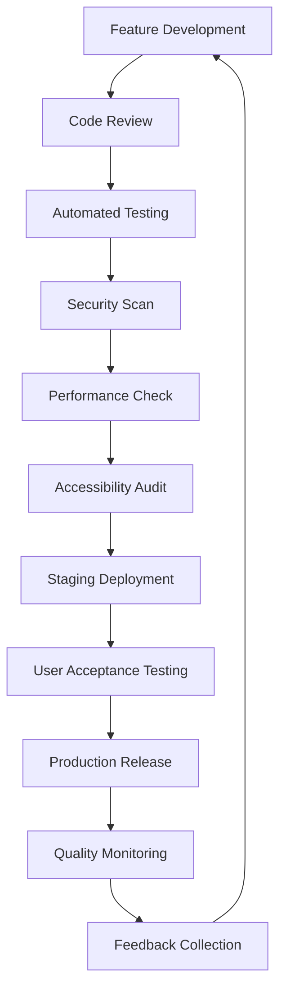

# 🕵️ PAIRED 2.0 Quality Assurance Strategy
*Master Quality Detective - Sherlock*

## 🎯 Quality Philosophy

**"Excellence is not an accident, but a habit"** - PAIRED 2.0's quality strategy ensures every agent, every feature, and every interaction meets the highest standards. We build quality into every layer, from code to user experience.

## 🔍 Multi-Layer Quality Framework

### Layer 1: Code Quality
```typescript
// Automated Code Quality Gates
interface CodeQualityStandards {
  coverage: '>90%';           // Unit test coverage
  complexity: '<10';          // Cyclomatic complexity
  duplication: '<3%';         // Code duplication
  maintainability: 'A';       // SonarQube rating
  security: 'Zero critical';  // Security vulnerabilities
  performance: '<200ms';      // API response time
}

// Pre-commit Hooks
const qualityChecks = [
  'lint-staged',              // ESLint + Prettier
  'type-check',               // TypeScript validation
  'test-affected',            // Run affected tests
  'security-scan',            // Dependency vulnerability check
  'performance-budget'        // Bundle size limits
];
```

### Layer 2: Agent Quality Certification
```yaml
# Agent Quality Certification Pipeline
agent_quality_pipeline:
  automated_testing:
    - functionality_tests: "All declared capabilities work"
    - integration_tests: "Compatible with target platforms"
    - performance_tests: "Response time < 5 seconds"
    - security_tests: "No vulnerabilities or data leaks"
    - accessibility_tests: "WCAG 2.1 AA compliance"
  
  human_review:
    - domain_expert_validation: "Capabilities match expertise"
    - user_experience_review: "Intuitive and helpful interactions"
    - documentation_quality: "Clear setup and usage instructions"
    - ethical_compliance: "No harmful or biased behavior"
  
  certification_levels:
    - bronze: "Basic functionality verified"
    - silver: "Performance and security validated"
    - gold: "Expert reviewed and user tested"
    - platinum: "Enterprise-grade certification"
```

### Layer 3: Platform Quality Assurance
- **System Integration Testing**: End-to-end workflow validation
- **Performance Monitoring**: Real-time quality metrics
- **User Experience Testing**: Usability and accessibility validation
- **Security Auditing**: Regular penetration testing and compliance checks

## 🧪 Testing Strategy

### Automated Testing Pyramid
```
                    🔺 E2E Tests (10%)
                   Critical user journeys
                  Cross-browser compatibility
                 
              🔺🔺 Integration Tests (20%)
             API contracts and database interactions
            Third-party service integrations
           Agent-to-platform communication
          
      🔺🔺🔺🔺 Unit Tests (70%)
     Business logic and utility functions
    Component behavior and edge cases
   Error handling and boundary conditions
```

### Testing Tools & Framework
- **Unit Testing**: Vitest + Testing Library
- **Integration Testing**: Supertest + Test Containers
- **E2E Testing**: Playwright (cross-browser)
- **Performance Testing**: Artillery + Lighthouse CI
- **Security Testing**: OWASP ZAP + Snyk
- **Accessibility Testing**: axe-core + Pa11y

### Agent-Specific Testing
```typescript
// Agent Testing Framework
interface AgentTestSuite {
  functionalTests: {
    capabilityValidation: boolean;
    toolIntegration: boolean;
    errorHandling: boolean;
    edgeCases: boolean;
  };
  
  performanceTests: {
    responseTime: number;        // < 5 seconds
    memoryUsage: number;         // < 100MB
    concurrentUsers: number;     // > 10 simultaneous
    throughput: number;          // > 100 requests/min
  };
  
  securityTests: {
    inputValidation: boolean;
    dataEncryption: boolean;
    accessControl: boolean;
    vulnerabilityScan: boolean;
  };
  
  usabilityTests: {
    setupComplexity: 'simple' | 'moderate' | 'complex';
    documentationQuality: 1 | 2 | 3 | 4 | 5;
    userSatisfaction: number;    // 1-10 scale
    errorRecovery: boolean;
  };
}
```

## 📊 Quality Metrics & Monitoring

### Real-Time Quality Dashboard
```typescript
// Quality Metrics Tracking
interface QualityMetrics {
  codeQuality: {
    testCoverage: number;        // Target: >90%
    bugDensity: number;          // Target: <0.1 bugs/KLOC
    technicalDebt: number;       // Target: <20% of capacity
    codeComplexity: number;      // Target: <10 cyclomatic
  };
  
  agentQuality: {
    certificationRate: number;   // Target: >80% certified
    userRating: number;          // Target: >4.5 stars
    installSuccess: number;      // Target: >95%
    activeUsage: number;         // Target: >70% monthly
  };
  
  platformQuality: {
    uptime: number;              // Target: >99.9%
    responseTime: number;        // Target: <200ms
    errorRate: number;           // Target: <0.1%
    userSatisfaction: number;    // Target: >4.7 NPS
  };
}
```

### Quality Gates & Thresholds
- **Code Merge**: 90% test coverage, zero critical issues
- **Agent Publication**: All certification tests pass
- **Feature Release**: Performance benchmarks met
- **Production Deploy**: Security scan clean, monitoring green

## 🔒 Security Quality Assurance

### Security Testing Framework
```yaml
security_testing:
  static_analysis:
    - code_scanning: "SonarQube + CodeQL"
    - dependency_check: "Snyk + npm audit"
    - secret_detection: "GitGuardian + TruffleHog"
  
  dynamic_analysis:
    - penetration_testing: "OWASP ZAP + Burp Suite"
    - api_security: "REST Assured + Postman"
    - authentication: "Auth0 security review"
  
  compliance_validation:
    - data_protection: "GDPR compliance check"
    - access_control: "RBAC validation"
    - encryption: "Data at rest and in transit"
    - audit_logging: "Complete activity tracking"
```

### Agent Security Standards
- **Sandboxing**: Isolated execution environment
- **Permission Model**: Least privilege access
- **Data Handling**: Encryption and privacy compliance
- **Code Review**: Security-focused peer review
- **Vulnerability Disclosure**: Responsible disclosure process

## 🎯 User Experience Quality

### UX Quality Framework
```typescript
// UX Quality Metrics
interface UXQualityStandards {
  accessibility: {
    wcagCompliance: 'AA';       // WCAG 2.1 AA minimum
    keyboardNavigation: true;   // Full keyboard access
    screenReader: true;         // Screen reader compatible
    colorContrast: 4.5;         // Minimum contrast ratio
  };
  
  usability: {
    taskCompletion: 0.95;       // 95% success rate
    timeOnTask: 180;            // < 3 minutes average
    errorRate: 0.05;            // < 5% error rate
    learnability: 0.8;          // 80% complete tasks on first try
  };
  
  performance: {
    pageLoad: 3;                // < 3 seconds
    interactivity: 0.3;         // < 300ms to interactive
    visualStability: 0.1;       // < 0.1 CLS score
    mobileOptimization: true;   // Mobile-first responsive
  };
}
```

### User Testing Program
- **Moderated Usability Testing**: Weekly sessions with target users
- **Unmoderated Testing**: Continuous feedback collection
- **A/B Testing**: Data-driven design decisions
- **Accessibility Testing**: Regular audits with disabled users
- **Beta Testing**: Early access program for feature validation

## 🚀 Quality Assurance Process

### Development Workflow


### Quality Review Checkpoints
1. **Design Review**: UX/UI quality validation
2. **Code Review**: Technical quality assessment
3. **Testing Review**: Test coverage and quality
4. **Security Review**: Security posture evaluation
5. **Performance Review**: Performance benchmark validation
6. **Accessibility Review**: Inclusive design compliance
7. **User Review**: Real user feedback integration

## 📈 Continuous Quality Improvement

### Quality Feedback Loops
- **Daily**: Automated quality metrics monitoring
- **Weekly**: Team quality retrospectives
- **Monthly**: Quality trend analysis and planning
- **Quarterly**: Comprehensive quality audits
- **Annually**: Quality strategy review and evolution

### Quality Culture Initiatives
- **Quality Champions**: Team members focused on quality advocacy
- **Quality Training**: Regular workshops on testing and quality practices
- **Quality Metrics**: Transparent quality dashboards for all teams
- **Quality Recognition**: Celebrating quality achievements and improvements
- **Quality Innovation**: Experimenting with new quality tools and practices

## 🎖️ Quality Certification Program

### Internal Quality Levels
- **Developer Certified**: Understands and follows quality standards
- **Quality Advocate**: Mentors others on quality practices
- **Quality Expert**: Leads quality initiatives and improvements
- **Quality Master**: Defines quality strategy and standards

### External Quality Validations
- **SOC 2 Type II**: Security and availability compliance
- **ISO 27001**: Information security management
- **WCAG 2.1 AA**: Web accessibility compliance
- **PCI DSS**: Payment card industry security (if applicable)

---

*Quality is not just what we test for—it's what we build into every decision, every line of code, and every user interaction. PAIRED 2.0's quality assurance ensures we deliver excellence at every level.*
