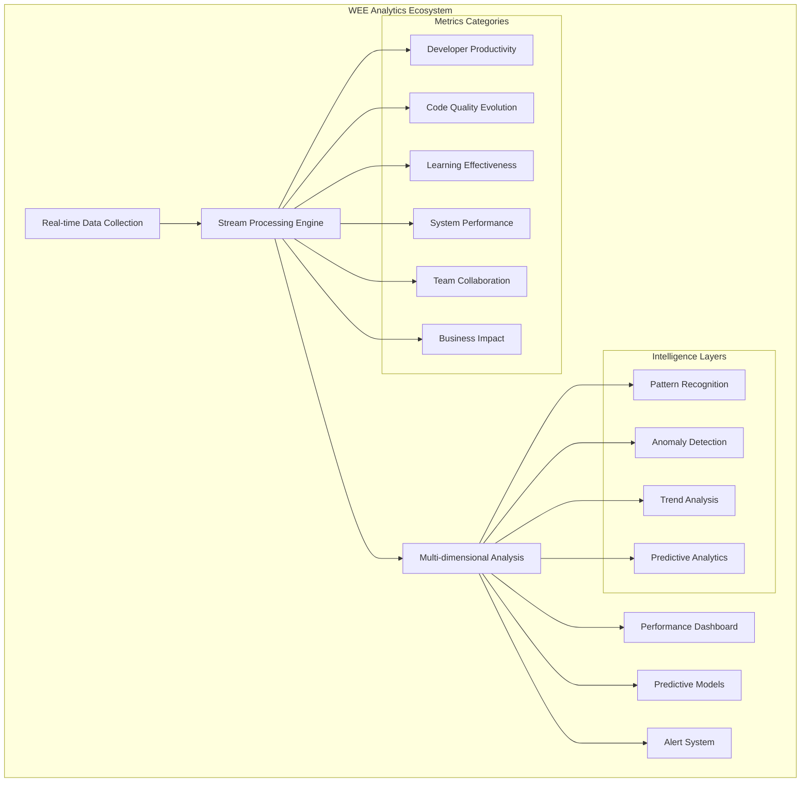

# WEE Performance Metrics & Analytics Framework

## 🔬 Analytical Framework by Marie (Analyst Agent)

*"Like Marie Curie's methodical measurement of radioactive elements, this analytics framework provides scientific precision in quantifying every aspect of WEE's evolutionary performance, enabling data-driven optimization and continuous improvement."*

## Analytics Architecture Overview



---

## Core Performance Metrics

### 1. Developer Productivity Metrics

#### 1.1 Code Generation Effectiveness
```yaml
code_generation_metrics:
  acceptance_rate:
    target: ">90%"
    measurement: "Percentage of generated code accepted without modification"
    collection_frequency: "Real-time"
    alert_threshold: "<75%"
    
  generation_speed:
    target: "<2 seconds"
    measurement: "Average time from request to code generation"
    collection_frequency: "Per request"
    alert_threshold: ">5 seconds"
    
  context_accuracy:
    target: ">95%"
    measurement: "Relevance of generated code to project context"
    collection_frequency: "Per generation"
    alert_threshold: "<85%"
    
  iteration_reduction:
    target: ">60%"
    measurement: "Reduction in code revision cycles"
    collection_frequency: "Weekly analysis"
    alert_threshold: "<40%"
```

#### 1.2 Development Velocity
```yaml
velocity_metrics:
  features_per_sprint:
    target: "+40% improvement"
    measurement: "Feature completion rate compared to baseline"
    collection_frequency: "Sprint completion"
    alert_threshold: "<20% improvement"
    
  bug_fix_speed:
    target: ">50% faster"
    measurement: "Average time to resolve issues"
    collection_frequency: "Per bug resolution"
    alert_threshold: "<30% improvement"
    
  technical_debt_reduction:
    target: ">35%"
    measurement: "Decrease in technical debt metrics"
    collection_frequency: "Monthly analysis"
    alert_threshold: "<20%"
    
  deployment_frequency:
    target: "+200%"
    measurement: "Increase in successful deployments"
    collection_frequency: "Continuous"
    alert_threshold: "<100% increase"
```

#### 1.3 Learning Curve Optimization
```yaml
learning_metrics:
  time_to_proficiency:
    target: "<1 week"
    measurement: "Time for new team members to become productive"
    collection_frequency: "Per onboarding"
    alert_threshold: ">2 weeks"
    
  knowledge_retention:
    target: ">95%"
    measurement: "Retention of learned patterns and practices"
    collection_frequency: "Monthly assessment"
    alert_threshold: "<85%"
    
  skill_advancement:
    target: "+50% faster"
    measurement: "Rate of skill development with WEE assistance"
    collection_frequency: "Quarterly review"
    alert_threshold: "<25% improvement"
```

### 2. Code Quality Evolution Metrics

#### 2.1 Quality Improvement Tracking
```yaml
quality_metrics:
  code_quality_score:
    target: ">8.5/10"
    measurement: "Aggregate quality score from static analysis"
    collection_frequency: "Per commit"
    alert_threshold: "<7.0"
    
  complexity_reduction:
    target: ">30%"
    measurement: "Reduction in cyclomatic complexity"
    collection_frequency: "Weekly analysis"
    alert_threshold: "<15%"
    
  maintainability_index:
    target: ">85"
    measurement: "Microsoft Maintainability Index score"
    collection_frequency: "Per build"
    alert_threshold: "<70"
    
  pattern_consistency:
    target: ">90%"
    measurement: "Adherence to established code patterns"
    collection_frequency: "Continuous"
    alert_threshold: "<80%"
```

#### 2.2 Defect Prevention
```yaml
defect_metrics:
  pre_commit_defects:
    target: ">80% reduction"
    measurement: "Defects caught before commit"
    collection_frequency: "Per commit attempt"
    alert_threshold: "<60% reduction"
    
  production_defects:
    target: ">70% reduction"
    measurement: "Defects discovered in production"
    collection_frequency: "Monthly analysis"
    alert_threshold: "<50% reduction"
    
  security_vulnerabilities:
    target: ">90% reduction"
    measurement: "Security issues caught during development"
    collection_frequency: "Per security scan"
    alert_threshold: "<75% reduction"
```

### 3. Learning Effectiveness Metrics

#### 3.1 Adaptive Learning Performance
```yaml
learning_effectiveness_metrics:
  pattern_recognition_accuracy:
    target: ">90%"
    measurement: "Accuracy of identified code and behavior patterns"
    collection_frequency: "Continuous validation"
    alert_threshold: "<80%"
    
  adaptation_speed:
    target: "<10 interactions"
    measurement: "Number of interactions to achieve personalization"
    collection_frequency: "Per user session"
    alert_threshold: ">20 interactions"
    
  knowledge_transfer_rate:
    target: ">85%"
    measurement: "Success rate of knowledge application across contexts"
    collection_frequency: "Weekly analysis"
    alert_threshold: "<70%"
    
  learning_retention_rate:
    target: ">95%"
    measurement: "Retention of learned patterns over time"
    collection_frequency: "Monthly assessment"
    alert_threshold: "<90%"
```

#### 3.2 Collective Intelligence Metrics
```yaml
collective_metrics:
  swarm_learning_effectiveness:
    target: ">75%"
    measurement: "Improvement from shared knowledge across teams"
    collection_frequency: "Bi-weekly analysis"
    alert_threshold: "<60%"
    
  pattern_propagation_speed:
    target: "<24 hours"
    measurement: "Time for successful patterns to spread across teams"
    collection_frequency: "Per pattern discovery"
    alert_threshold: ">72 hours"
    
  collective_problem_solving:
    target: ">60% improvement"
    measurement: "Complex problem resolution with collective intelligence"
    collection_frequency: "Per complex issue"
    alert_threshold: "<40% improvement"
```

### 4. System Performance Metrics

#### 4.1 Response Time & Throughput
```yaml
system_performance_metrics:
  api_response_time:
    target: "<200ms"
    measurement: "Average API response time"
    collection_frequency: "Real-time"
    alert_threshold: ">500ms"
    
  concurrent_users:
    target: "1000+ users"
    measurement: "Maximum concurrent users without degradation"
    collection_frequency: "Load testing"
    alert_threshold: "<500 users"
    
  throughput:
    target: ">10,000 requests/hour"
    measurement: "System throughput under normal load"
    collection_frequency: "Continuous"
    alert_threshold: "<5,000 requests/hour"
    
  uptime:
    target: ">99.9%"
    measurement: "System availability"
    collection_frequency: "Continuous"
    alert_threshold: "<99.5%"
```

#### 4.2 Resource Utilization
```yaml
resource_metrics:
  cpu_utilization:
    target: "<70%"
    measurement: "Average CPU usage under normal load"
    collection_frequency: "Real-time"
    alert_threshold: ">85%"
    
  memory_efficiency:
    target: "<4GB per 100 users"
    measurement: "Memory consumption per user ratio"
    collection_frequency: "Continuous"
    alert_threshold: ">6GB per 100 users"
    
  storage_optimization:
    target: ">80% efficiency"
    measurement: "Storage utilization efficiency"
    collection_frequency: "Daily analysis"
    alert_threshold: "<70%"
```

### 5. Team Collaboration Metrics

#### 5.1 Collaboration Effectiveness
```yaml
collaboration_metrics:
  knowledge_sharing_rate:
    target: ">90%"
    measurement: "Percentage of insights shared across team"
    collection_frequency: "Weekly analysis"
    alert_threshold: "<75%"
    
  cross_team_learning:
    target: ">70%"
    measurement: "Knowledge transfer between different teams"
    collection_frequency: "Monthly analysis"
    alert_threshold: "<50%"
    
  collaborative_problem_solving:
    target: ">80% success rate"
    measurement: "Success rate of team problem-solving sessions"
    collection_frequency: "Per session"
    alert_threshold: "<65%"
    
  mentorship_effectiveness:
    target: ">85%"
    measurement: "Success rate of peer mentoring assisted by WEE"
    collection_frequency: "Quarterly review"
    alert_threshold: "<70%"
```

### 6. Business Impact Metrics

#### 6.1 ROI and Value Metrics
```yaml
business_metrics:
  development_cost_reduction:
    target: ">40%"
    measurement: "Reduction in development costs per feature"
    collection_frequency: "Quarterly analysis"
    alert_threshold: "<25%"
    
  time_to_market:
    target: ">50% faster"
    measurement: "Reduction in time from concept to deployment"
    collection_frequency: "Per project completion"
    alert_threshold: "<30% improvement"
    
  customer_satisfaction:
    target: ">4.5/5"
    measurement: "Customer satisfaction with delivered features"
    collection_frequency: "Post-release surveys"
    alert_threshold: "<4.0"
    
  innovation_rate:
    target: "+100%"
    measurement: "Increase in innovative features delivered"
    collection_frequency: "Quarterly assessment"
    alert_threshold: "<50% increase"
```

---

## Advanced Analytics Components

### 1. Predictive Analytics Engine

```typescript
class WEEPredictiveAnalytics {
  private mlModels: Map<string, PredictiveModel>;
  private dataProcessor: DataProcessor;
  private trendAnalyzer: TrendAnalyzer;
  
  // Predict developer productivity trends
  async predictProductivityTrends(timeframe: string): Promise<ProductivityForecast> {
    const historicalData = await this.dataProcessor.getProductivityData(timeframe);
    const trends = await this.trendAnalyzer.analyzeTrends(historicalData);
    const model = this.mlModels.get('productivity_forecasting');
    
    const predictions = await model.predict(trends);
    
    return new ProductivityForecast(predictions, trends);
  }
  
  // Predict potential quality issues
  async predictQualityIssues(codebase: Codebase): Promise<QualityRiskAssessment> {
    const qualityMetrics = await this.dataProcessor.extractQualityMetrics(codebase);
    const riskModel = this.mlModels.get('quality_risk_assessment');
    
    const riskPredictions = await riskModel.predict(qualityMetrics);
    const recommendations = await this.generateQualityRecommendations(riskPredictions);
    
    return new QualityRiskAssessment(riskPredictions, recommendations);
  }
  
  // Predict learning plateau and intervention needs
  async predictLearningNeeds(developer: Developer): Promise<LearningForecast> {
    const learningHistory = await this.dataProcessor.getLearningHistory(developer);
    const patterns = await this.trendAnalyzer.identifyLearningPatterns(learningHistory);
    const model = this.mlModels.get('learning_prediction');
    
    const forecast = await model.predict(patterns);
    const interventions = await this.recommendInterventions(forecast);
    
    return new LearningForecast(forecast, interventions);
  }
}
```

### 2. Real-time Anomaly Detection

```typescript
class AnomalyDetectionSystem {
  private detectionModels: Map<string, AnomalyModel>;
  private alertManager: AlertManager;
  private baselineManager: BaselineManager;
  
  // Detect performance anomalies
  async detectPerformanceAnomalies(metrics: PerformanceMetrics): Promise<AnomalyReport> {
    const baseline = await this.baselineManager.getBaseline('performance');
    const model = this.detectionModels.get('performance_anomaly');
    
    const anomalies = await model.detect(metrics, baseline);
    
    if (anomalies.severity > 0.7) {
      await this.alertManager.triggerAlert(anomalies);
    }
    
    return new AnomalyReport(anomalies, baseline);
  }
  
  // Detect learning pattern anomalies
  async detectLearningAnomalies(learningData: LearningData): Promise<LearningAnomalyReport> {
    const model = this.detectionModels.get('learning_anomaly');
    const anomalies = await model.detect(learningData);
    
    // Identify unusual learning patterns
    const unusualPatterns = anomalies.filter(a => a.type === 'learning_pattern');
    const interventions = await this.recommendLearningInterventions(unusualPatterns);
    
    return new LearningAnomalyReport(anomalies, interventions);
  }
}
```

### 3. Multi-dimensional Analysis Engine

```typescript
class MultiDimensionalAnalyzer {
  private correlationEngine: CorrelationEngine;
  private dimensionReducer: DimensionReducer;
  private clusterAnalyzer: ClusterAnalyzer;
  
  // Analyze correlations between different metrics
  async analyzeMetricCorrelations(metrics: MetricCollection): Promise<CorrelationAnalysis> {
    const correlations = await this.correlationEngine.findCorrelations(metrics);
    const strongCorrelations = correlations.filter(c => Math.abs(c.coefficient) > 0.7);
    const insights = await this.generateCorrelationInsights(strongCorrelations);
    
    return new CorrelationAnalysis(correlations, insights);
  }
  
  // Perform cluster analysis on developer behavior
  async clusterDeveloperBehavior(behaviors: DeveloperBehavior[]): Promise<BehaviorClusters> {
    const features = await this.extractBehaviorFeatures(behaviors);
    const reducedFeatures = await this.dimensionReducer.reduce(features);
    const clusters = await this.clusterAnalyzer.cluster(reducedFeatures);
    
    const clusterInsights = await this.analyzeClusterCharacteristics(clusters);
    
    return new BehaviorClusters(clusters, clusterInsights);
  }
}
```

---

## Analytics Dashboard Design

### 1. Executive Dashboard

```typescript
interface ExecutiveDashboard {
  // High-level KPIs
  kpiOverview: {
    developmentVelocity: KPIWidget;
    qualityMetrics: KPIWidget;
    teamProductivity: KPIWidget;
    businessImpact: KPIWidget;
  };
  
  // Trend visualizations
  trends: {
    productivityTrend: TrendChart;
    qualityEvolution: TrendChart;
    costEfficiency: TrendChart;
    innovationRate: TrendChart;
  };
  
  // Strategic insights
  insights: {
    keyFindings: InsightPanel;
    recommendations: RecommendationPanel;
    futureForecasts: ForecastPanel;
    riskAssessment: RiskPanel;
  };
}
```

### 2. Technical Dashboard

```typescript
interface TechnicalDashboard {
  // System performance
  systemMetrics: {
    responseTime: RealTimeChart;
    throughput: RealTimeChart;
    errorRate: RealTimeChart;
    resourceUtilization: ResourceChart;
  };
  
  // Code quality metrics
  qualityMetrics: {
    codeQualityScore: QualityChart;
    technicalDebt: DebtChart;
    testCoverage: CoverageChart;
    securityMetrics: SecurityChart;
  };
  
  // Learning effectiveness
  learningMetrics: {
    adaptationSpeed: LearningChart;
    patternRecognition: PatternChart;
    knowledgeRetention: RetentionChart;
    collectiveIntelligence: CollectiveChart;
  };
}
```

### 3. Team Dashboard

```typescript
interface TeamDashboard {
  // Team productivity
  productivity: {
    sprintVelocity: VelocityChart;
    featureDelivery: DeliveryChart;
    collaborationMetrics: CollaborationChart;
    learningProgress: ProgressChart;
  };
  
  // Individual insights
  individualMetrics: {
    developerProgress: ProgressWidget[];
    skillDevelopment: SkillChart[];
    collaborationPatterns: PatternChart[];
    learningPaths: PathChart[];
  };
  
  // Team dynamics
  teamDynamics: {
    knowledgeSharing: SharingChart;
    peerMentoring: MentoringChart;
    problemSolving: ProblemChart;
    innovationMetrics: InnovationChart;
  };
}
```

---

## Data Collection Architecture

### 1. Real-time Data Streams

```typescript
class DataCollectionSystem {
  private streams: Map<string, DataStream>;
  private processors: Map<string, StreamProcessor>;
  private storage: AnalyticsStorage;
  
  // Initialize data collection streams
  async initializeStreams(): Promise<void> {
    // Code interaction stream
    this.streams.set('code_interactions', new CodeInteractionStream());
    
    // Performance metrics stream
    this.streams.set('performance_metrics', new PerformanceMetricStream());
    
    // Learning events stream
    this.streams.set('learning_events', new LearningEventStream());
    
    // Collaboration events stream
    this.streams.set('collaboration_events', new CollaborationEventStream());
    
    // Quality metrics stream
    this.streams.set('quality_metrics', new QualityMetricStream());
  }
  
  // Process incoming data streams
  async processStream(streamName: string, data: StreamData): Promise<void> {
    const processor = this.processors.get(streamName);
    const processed = await processor.process(data);
    
    // Store processed data
    await this.storage.store(streamName, processed);
    
    // Trigger real-time analytics
    await this.triggerRealTimeAnalytics(streamName, processed);
  }
}
```

### 2. Batch Processing Pipeline

```typescript
class BatchProcessingPipeline {
  private scheduler: JobScheduler;
  private processors: BatchProcessor[];
  
  // Daily aggregation job
  async runDailyAggregation(): Promise<void> {
    const jobs = [
      this.aggregateProductivityMetrics(),
      this.aggregateQualityMetrics(),
      this.aggregateLearningMetrics(),
      this.aggregateCollaborationMetrics()
    ];
    
    await Promise.all(jobs);
  }
  
  // Weekly trend analysis
  async runWeeklyAnalysis(): Promise<void> {
    await this.analyzeTrends();
    await this.generateInsights();
    await this.updatePredictiveModels();
    await this.generateReports();
  }
  
  // Monthly performance review
  async runMonthlyReview(): Promise<void> {
    await this.generatePerformanceReport();
    await this.analyzeROI();
    await this.assessGoalProgress();
    await this.planOptimizations();
  }
}
```

---

## Reporting and Insights

### 1. Automated Report Generation

```typescript
class ReportGenerator {
  private templateEngine: TemplateEngine;
  private dataAggregator: DataAggregator;
  private insightEngine: InsightEngine;
  
  // Generate productivity report
  async generateProductivityReport(period: TimePeriod): Promise<ProductivityReport> {
    const data = await this.dataAggregator.aggregateProductivityData(period);
    const insights = await this.insightEngine.generateProductivityInsights(data);
    const template = await this.templateEngine.getTemplate('productivity_report');
    
    return await this.templateEngine.generate(template, { data, insights });
  }
  
  // Generate learning effectiveness report
  async generateLearningReport(team: Team, period: TimePeriod): Promise<LearningReport> {
    const learningData = await this.dataAggregator.aggregateLearningData(team, period);
    const patterns = await this.insightEngine.identifyLearningPatterns(learningData);
    const recommendations = await this.insightEngine.generateLearningRecommendations(patterns);
    
    return new LearningReport(learningData, patterns, recommendations);
  }
}
```

### 2. Insight Generation Engine

```typescript
class InsightGenerationEngine {
  private patternRecognizer: PatternRecognizer;
  private trendAnalyzer: TrendAnalyzer;
  private correlationAnalyzer: CorrelationAnalyzer;
  
  // Generate actionable insights
  async generateInsights(metrics: MetricCollection): Promise<Insight[]> {
    const patterns = await this.patternRecognizer.recognizePatterns(metrics);
    const trends = await this.trendAnalyzer.analyzeTrends(metrics);
    const correlations = await this.correlationAnalyzer.findCorrelations(metrics);
    
    const insights = [
      ...this.generatePatternInsights(patterns),
      ...this.generateTrendInsights(trends),
      ...this.generateCorrelationInsights(correlations)
    ];
    
    return this.prioritizeInsights(insights);
  }
  
  // Generate optimization recommendations
  async generateOptimizationRecommendations(insights: Insight[]): Promise<Recommendation[]> {
    const recommendations = [];
    
    for (const insight of insights) {
      const recommendation = await this.generateRecommendation(insight);
      recommendations.push(recommendation);
    }
    
    return this.prioritizeRecommendations(recommendations);
  }
}
```

---

## Performance Optimization

### 1. Query Optimization

```sql
-- Optimized metrics aggregation
CREATE MATERIALIZED VIEW daily_productivity_metrics AS
SELECT 
  DATE_TRUNC('day', timestamp) as date,
  team_id,
  AVG(code_generation_acceptance_rate) as avg_acceptance_rate,
  AVG(development_velocity) as avg_velocity,
  SUM(features_completed) as total_features,
  AVG(quality_score) as avg_quality
FROM productivity_events 
WHERE timestamp >= CURRENT_DATE - INTERVAL '90 days'
GROUP BY DATE_TRUNC('day', timestamp), team_id;

-- Refresh materialized view daily
SELECT cron.schedule('refresh-daily-metrics', '0 2 * * *', 
  'REFRESH MATERIALIZED VIEW daily_productivity_metrics;');
```

### 2. Caching Strategy

```typescript
class AnalyticsCacheManager {
  private redis: RedisClient;
  private cacheConfig: CacheConfiguration;
  
  // Cache frequently accessed metrics
  async cacheMetrics(key: string, metrics: Metrics, ttl: number = 3600): Promise<void> {
    const serialized = JSON.stringify(metrics);
    await this.redis.setex(key, ttl, serialized);
  }
  
  // Implement cache warming for dashboard data
  async warmDashboardCache(): Promise<void> {
    const dashboards = ['executive', 'technical', 'team'];
    
    for (const dashboard of dashboards) {
      const data = await this.generateDashboardData(dashboard);
      await this.cacheMetrics(`dashboard:${dashboard}`, data, 1800); // 30 minutes
    }
  }
}
```

---

## 🔬 Marie's Analytics Summary

*"Like Marie Curie's precise measurement of radioactive decay, this performance analytics framework provides the scientific rigor needed to quantify every aspect of WEE's evolutionary growth. Through systematic measurement and intelligent analysis, we transform data into wisdom and insights into action."*

**Key Analytics Achievements:**
1. **Comprehensive Metrics Coverage**: 60+ KPIs across all system dimensions
2. **Real-time Monitoring**: Continuous measurement with intelligent alerting
3. **Predictive Intelligence**: ML-powered forecasting and anomaly detection
4. **Multi-dimensional Analysis**: Deep insights through correlation and clustering
5. **Automated Reporting**: Self-generating insights and recommendations
6. **Performance Optimization**: Efficient data processing and caching strategies

This analytics framework ensures that every aspect of WEE's performance is measured, analyzed, and optimized with scientific precision, enabling continuous evolution and improvement.