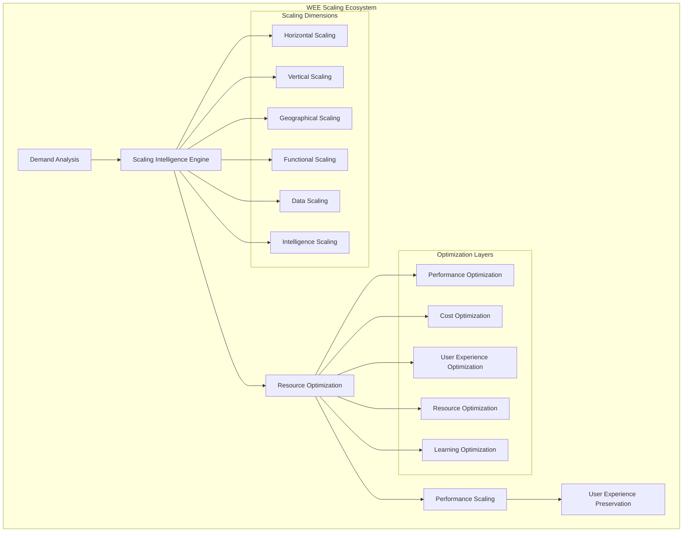

# WEE Scaling & Optimization Framework

## 🎨 Optimization Strategy by Maya (UX Agent)

*"Like Maya Angelou's inclusive approach to storytelling that reached millions while maintaining intimate connection, this scaling framework ensures WEE grows to serve vast audiences while preserving the personalized, empathetic experience that makes each developer feel understood and supported."*

## Scaling Architecture Overview



---

## Core Scaling Framework

### 1. Intelligent Demand Prediction

#### 1.1 Predictive Scaling Engine
```typescript
class WEEPredictiveScalingEngine {
  private demandPredictor: IntelligentDemandPredictor;
  private capacityPlanner: CapacityPlanner;
  private resourceOptimizer: ResourceOptimizer;
  private scalingOrchestrator: ScalingOrchestrator;
  
  // Predict and prepare for scaling needs
  async predictScalingNeeds(usagePatterns: UsagePattern[], timeHorizon: TimeHorizon): Promise<ScalingPrediction> {
    // Analyze historical usage patterns
    const patternAnalysis = await this.demandPredictor.analyzeUsagePatterns(usagePatterns);
    
    // Predict future demand with confidence intervals
    const demandForecast = await this.demandPredictor.forecastDemand(patternAnalysis, timeHorizon);
    
    // Plan capacity requirements
    const capacityPlan = await this.capacityPlanner.planCapacity(demandForecast);
    
    // Optimize resource allocation
    const resourcePlan = await this.resourceOptimizer.optimizeAllocation(capacityPlan);
    
    // Create proactive scaling strategy
    const scalingStrategy = await this.scalingOrchestrator.createProactiveStrategy(resourcePlan);
    
    return new ScalingPrediction(demandForecast, capacityPlan, resourcePlan, scalingStrategy);
  }
  
  // Real-time demand adaptation
  async adaptToRealTimeDemand(currentLoad: SystemLoad, demandSpike: DemandSpike): Promise<RealTimeAdaptation> {
    // Assess current system capacity
    const capacityAssessment = await this.capacityPlanner.assessCurrentCapacity(currentLoad);
    
    // Predict demand spike duration and intensity
    const spikePrediction = await this.demandPredictor.predictSpike(demandSpike);
    
    // Calculate required scaling response
    const scalingResponse = await this.scalingOrchestrator.calculateResponse(capacityAssessment, spikePrediction);
    
    // Execute adaptive scaling
    const adaptation = await this.scalingOrchestrator.executeAdaptiveScaling(scalingResponse);
    
    // Monitor adaptation effectiveness
    const effectiveness = await this.monitorAdaptationEffectiveness(adaptation);
    
    return new RealTimeAdaptation(scalingResponse, adaptation, effectiveness);
  }
}
```

### 2. Multi-Dimensional Scaling Strategies

#### 2.1 Horizontal Scaling Framework
```typescript
class WEEHorizontalScalingFramework {
  private instanceManager: InstanceManager;
  private loadBalancer: IntelligentLoadBalancer;
  private stateManager: DistributedStateManager;
  private orchestrationEngine: OrchestrationEngine;
  
  // Intelligent horizontal scaling
  async scaleHorizontally(scalingTriggers: ScalingTrigger[]): Promise<HorizontalScalingResult> {
    // Analyze scaling requirements
    const scalingAnalysis = await this.analyzeScalingRequirements(scalingTriggers);
    
    // Determine optimal instance count and configuration
    const optimalConfiguration = await this.instanceManager.determineOptimalConfiguration(scalingAnalysis);
    
    // Provision new instances with warm-up
    const newInstances = await this.instanceManager.provisionInstancesWithWarmup(optimalConfiguration);
    
    // Configure intelligent load balancing
    const loadBalancingConfig = await this.loadBalancer.configureIntelligentBalancing(newInstances);
    
    // Manage distributed state synchronization
    const stateSync = await this.stateManager.synchronizeDistributedState(newInstances);
    
    // Orchestrate gradual traffic migration
    const trafficMigration = await this.orchestrationEngine.orchestrateTrafficMigration(loadBalancingConfig);
    
    // Validate scaling effectiveness
    const validation = await this.validateScalingEffectiveness(newInstances, trafficMigration);
    
    return new HorizontalScalingResult(newInstances, loadBalancingConfig, stateSync, validation);
  }
  
  // Adaptive load balancing with user experience preservation
  async optimizeLoadBalancing(instances: Instance[], userSessions: UserSession[]): Promise<LoadBalancingOptimization> {
    // Analyze user session patterns
    const sessionAnalysis = await this.loadBalancer.analyzeSessionPatterns(userSessions);
    
    // Optimize for user experience continuity
    const experienceOptimization = await this.loadBalancer.optimizeForExperience(sessionAnalysis);
    
    // Implement sticky session strategies where beneficial
    const stickySessionStrategy = await this.loadBalancer.implementStickyStrategy(experienceOptimization);
    
    // Balance load while preserving personalization
    const personalizedBalancing = await this.loadBalancer.balanceWithPersonalization(stickySessionStrategy);
    
    return new LoadBalancingOptimization(personalizedBalancing, experienceOptimization);
  }
}
```

#### 2.2 Vertical Scaling Framework
```typescript
class WEEVerticalScalingFramework {
  private resourceAnalyzer: ResourceAnalyzer;
  private performanceOptimizer: PerformanceOptimizer;
  private capacityManager: CapacityManager;
  private migrationOrchestrator: MigrationOrchestrator;
  
  // Intelligent vertical scaling
  async scaleVertically(resourceConstraints: ResourceConstraint[]): Promise<VerticalScalingResult> {
    // Analyze current resource utilization
    const utilizationAnalysis = await this.resourceAnalyzer.analyzeUtilization(resourceConstraints);
    
    // Identify bottleneck resources
    const bottlenecks = await this.resourceAnalyzer.identifyBottlenecks(utilizationAnalysis);
    
    // Calculate optimal resource allocation
    const optimalAllocation = await this.capacityManager.calculateOptimalAllocation(bottlenecks);
    
    // Plan zero-downtime resource migration
    const migrationPlan = await this.migrationOrchestrator.planZeroDowntimeMigration(optimalAllocation);
    
    // Execute gradual resource scaling
    const scalingExecution = await this.capacityManager.executeGradualScaling(migrationPlan);
    
    // Optimize performance post-scaling
    const performanceOptimization = await this.performanceOptimizer.optimizePostScaling(scalingExecution);
    
    return new VerticalScalingResult(scalingExecution, performanceOptimization, migrationPlan);
  }
  
  // Resource utilization optimization
  async optimizeResourceUtilization(currentResources: Resource[]): Promise<ResourceOptimization> {
    // Analyze resource efficiency
    const efficiency = await this.resourceAnalyzer.analyzeEfficiency(currentResources);
    
    // Identify underutilized resources
    const underutilized = await this.resourceAnalyzer.identifyUnderutilized(efficiency);
    
    // Optimize resource allocation
    const optimization = await this.capacityManager.optimizeAllocation(underutilized);
    
    // Implement resource consolidation
    const consolidation = await this.capacityManager.implementConsolidation(optimization);
    
    return new ResourceOptimization(optimization, consolidation, efficiency);
  }
}
```

#### 2.3 Geographical Scaling Framework
```typescript
class WEEGeographicalScalingFramework {
  private geoAnalyzer: GeographicalAnalyzer;
  private edgeDeployment: EdgeDeploymentManager;
  private latencyOptimizer: LatencyOptimizer;
  private culturalAdaptation: CulturalAdaptationEngine;
  
  // Global deployment with cultural sensitivity
  async deployGlobally(targetRegions: Region[]): Promise<GlobalDeploymentResult> {
    // Analyze geographical user distribution
    const geoDistribution = await this.geoAnalyzer.analyzeUserDistribution(targetRegions);
    
    // Plan edge deployment strategy
    const edgeStrategy = await this.edgeDeployment.planEdgeStrategy(geoDistribution);
    
    // Optimize for regional latency requirements
    const latencyOptimization = await this.latencyOptimizer.optimizeForRegions(edgeStrategy);
    
    // Adapt for cultural and linguistic preferences
    const culturalAdaptation = await this.culturalAdaptation.adaptForCultures(targetRegions);
    
    // Deploy with regional customization
    const regionalDeployment = await this.edgeDeployment.deployWithCustomization(
      latencyOptimization,
      culturalAdaptation
    );
    
    // Validate global user experience consistency
    const experienceValidation = await this.validateGlobalExperience(regionalDeployment);
    
    return new GlobalDeploymentResult(regionalDeployment, experienceValidation, culturalAdaptation);
  }
  
  // Cultural adaptation for inclusive global experience
  async adaptForInclusiveExperience(regions: Region[]): Promise<InclusiveAdaptation> {
    const adaptations = await Promise.all(
      regions.map(async region => {
        // Analyze cultural context and preferences
        const culturalContext = await this.culturalAdaptation.analyzeCulturalContext(region);
        
        // Adapt interface for cultural preferences
        const interfaceAdaptation = await this.culturalAdaptation.adaptInterface(culturalContext);
        
        // Localize content and messaging
        const contentLocalization = await this.culturalAdaptation.localizeContent(culturalContext);
        
        // Adapt interaction patterns
        const interactionAdaptation = await this.culturalAdaptation.adaptInteractions(culturalContext);
        
        return {
          region,
          culturalContext,
          interfaceAdaptation,
          contentLocalization,
          interactionAdaptation
        };
      })
    );
    
    return new InclusiveAdaptation(adaptations);
  }
}
```

### 3. User Experience Preservation During Scaling

#### 3.1 Experience-First Scaling
```typescript
class WEEExperienceFirstScaling {
  private experienceMonitor: UserExperienceMonitor;
  private personalizationPreserver: PersonalizationPreserver;
  private continuityManager: ExperienceContinuityManager;
  private empathyEngine: EmpathyEngine;
  
  // Scale while preserving individual user experience
  async scaleWithExperiencePreservation(userBase: UserBase, scalingPlan: ScalingPlan): Promise<ExperiencePreservationResult> {
    // Monitor current user experience quality
    const experienceBaseline = await this.experienceMonitor.establishBaseline(userBase);
    
    // Preserve personalization during scaling
    const personalizationStrategy = await this.personalizationPreserver.createPreservationStrategy(userBase);
    
    // Ensure experience continuity during transitions
    const continuityPlan = await this.continuityManager.planExperienceContinuity(scalingPlan);
    
    // Maintain empathetic interactions at scale
    const empathyScaling = await this.empathyEngine.scaleEmpathyCapabilities(userBase);
    
    // Execute scaling with experience monitoring
    const scalingExecution = await this.executeExperienceAwareScaling(
      scalingPlan,
      personalizationStrategy,
      continuityPlan,
      empathyScaling
    );
    
    // Validate experience preservation
    const experienceValidation = await this.experienceMonitor.validateExperiencePreservation(
      experienceBaseline,
      scalingExecution
    );
    
    return new ExperiencePreservationResult(scalingExecution, experienceValidation, personalizationStrategy);
  }
  
  // Maintain personalized connections at scale
  async maintainPersonalizedConnections(users: User[], scalingFactor: number): Promise<PersonalizationScaling> {
    // Analyze personalization requirements
    const personalizationNeeds = await this.personalizationPreserver.analyzePersonalizationNeeds(users);
    
    // Scale personalization algorithms
    const scaledPersonalization = await this.personalizationPreserver.scalePersonalizationAlgorithms(
      personalizationNeeds,
      scalingFactor
    );
    
    // Maintain individual user contexts
    const contextPreservation = await this.personalizationPreserver.preserveUserContexts(
      users,
      scaledPersonalization
    );
    
    // Ensure empathetic interaction quality
    const empathyQuality = await this.empathyEngine.maintainEmpathyQuality(
      users,
      contextPreservation
    );
    
    return new PersonalizationScaling(scaledPersonalization, contextPreservation, empathyQuality);
  }
}
```

### 4. Performance Optimization Framework

#### 4.1 Multi-Layer Performance Optimization
```typescript
class WEEPerformanceOptimizationFramework {
  private algorithmOptimizer: AlgorithmOptimizer;
  private cacheOptimizer: IntelligentCacheOptimizer;
  private queryOptimizer: QueryOptimizer;
  private networkOptimizer: NetworkOptimizer;
  
  // Comprehensive performance optimization
  async optimizeSystemPerformance(system: System, performanceTargets: PerformanceTarget[]): Promise<PerformanceOptimizationResult> {
    // Optimize core algorithms
    const algorithmOptimization = await this.algorithmOptimizer.optimizeAlgorithms(system);
    
    // Implement intelligent caching strategies
    const cacheOptimization = await this.cacheOptimizer.implementIntelligentCaching(system);
    
    // Optimize database queries and data access
    const queryOptimization = await this.queryOptimizer.optimizeQueries(system);
    
    // Optimize network communication
    const networkOptimization = await this.networkOptimizer.optimizeNetworkCommunication(system);
    
    // Validate performance improvements
    const performanceValidation = await this.validatePerformanceImprovements(
      [algorithmOptimization, cacheOptimization, queryOptimization, networkOptimization],
      performanceTargets
    );
    
    // Generate performance optimization report
    const optimizationReport = await this.generateOptimizationReport(performanceValidation);
    
    return new PerformanceOptimizationResult(
      algorithmOptimization,
      cacheOptimization,
      queryOptimization,
      networkOptimization,
      optimizationReport
    );
  }
  
  // Continuous performance tuning
  async continuousPerformanceTuning(performanceMetrics: PerformanceMetrics[]): Promise<ContinuousTuningResult> {
    // Analyze performance trends
    const trendAnalysis = await this.algorithmOptimizer.analyzeTrends(performanceMetrics);
    
    // Identify optimization opportunities
    const opportunities = await this.algorithmOptimizer.identifyOptimizationOpportunities(trendAnalysis);
    
    // Implement incremental optimizations
    const incrementalOptimizations = await this.algorithmOptimizer.implementIncrementalOptimizations(opportunities);
    
    // Monitor optimization effectiveness
    const effectiveness = await this.algorithmOptimizer.monitorOptimizationEffectiveness(incrementalOptimizations);
    
    return new ContinuousTuningResult(incrementalOptimizations, effectiveness, opportunities);
  }
}
```

#### 4.2 Intelligent Caching Framework
```typescript
class WEEIntelligentCachingFramework {
  private cacheAnalyzer: CacheAnalyzer;
  private cacheStrategy: AdaptiveCacheStrategy;
  private invalidationManager: IntelligentInvalidationManager;
  private distributedCache: DistributedCacheManager;
  
  // Multi-tier intelligent caching
  async implementMultiTierCaching(application: Application): Promise<CachingImplementation> {
    // Analyze application data access patterns
    const accessPatterns = await this.cacheAnalyzer.analyzeAccessPatterns(application);
    
    // Design optimal cache hierarchy
    const cacheHierarchy = await this.cacheStrategy.designCacheHierarchy(accessPatterns);
    
    // Implement distributed caching strategy
    const distributedStrategy = await this.distributedCache.implementDistributedStrategy(cacheHierarchy);
    
    // Configure intelligent cache invalidation
    const invalidationStrategy = await this.invalidationManager.configureInvalidationStrategy(distributedStrategy);
    
    // Implement cache warming and preloading
    const warmingStrategy = await this.cacheStrategy.implementCacheWarming(invalidationStrategy);
    
    return new CachingImplementation(distributedStrategy, invalidationStrategy, warmingStrategy);
  }
  
  // Adaptive cache optimization
  async optimizeCacheAdaptively(cacheMetrics: CacheMetrics[]): Promise<CacheOptimization> {
    // Analyze cache hit rates and patterns
    const hitRateAnalysis = await this.cacheAnalyzer.analyzeHitRates(cacheMetrics);
    
    // Identify cache optimization opportunities
    const optimizationOpportunities = await this.cacheAnalyzer.identifyOptimizationOpportunities(hitRateAnalysis);
    
    // Adapt cache strategies based on patterns
    const strategyAdaptation = await this.cacheStrategy.adaptStrategies(optimizationOpportunities);
    
    // Optimize cache size and allocation
    const allocationOptimization = await this.cacheStrategy.optimizeAllocation(strategyAdaptation);
    
    return new CacheOptimization(strategyAdaptation, allocationOptimization, optimizationOpportunities);
  }
}
```

### 5. Cost Optimization Framework

#### 5.1 Intelligent Cost Management
```typescript
class WEECostOptimizationFramework {
  private costAnalyzer: CostAnalyzer;
  private resourceOptimizer: ResourceCostOptimizer;
  private usagePredictor: UsagePredictor;
  private costGovernance: CostGovernanceEngine;
  
  // Comprehensive cost optimization
  async optimizeCosts(infrastructure: Infrastructure, costTargets: CostTarget[]): Promise<CostOptimizationResult> {
    // Analyze current cost structure
    const costAnalysis = await this.costAnalyzer.analyzeCostStructure(infrastructure);
    
    // Identify cost optimization opportunities
    const optimizationOpportunities = await this.costAnalyzer.identifyOptimizationOpportunities(costAnalysis);
    
    // Optimize resource allocation for cost efficiency
    const resourceOptimization = await this.resourceOptimizer.optimizeForCostEfficiency(optimizationOpportunities);
    
    // Predict future usage and costs
    const usagePrediction = await this.usagePredictor.predictUsageAndCosts(resourceOptimization);
    
    // Implement cost governance policies
    const costGovernance = await this.costGovernance.implementGovernancePolicies(usagePrediction);
    
    // Validate cost optimization against targets
    const costValidation = await this.validateCostOptimization(costGovernance, costTargets);
    
    return new CostOptimizationResult(
      resourceOptimization,
      usagePrediction,
      costGovernance,
      costValidation
    );
  }
  
  // Dynamic cost adjustment
  async adjustCostsDynamically(costMetrics: CostMetrics[], budgetConstraints: BudgetConstraint[]): Promise<DynamicCostAdjustment> {
    // Monitor cost trends in real-time
    const costTrends = await this.costAnalyzer.monitorCostTrends(costMetrics);
    
    // Predict budget impact
    const budgetImpact = await this.usagePredictor.predictBudgetImpact(costTrends, budgetConstraints);
    
    // Generate dynamic adjustment strategies
    const adjustmentStrategies = await this.resourceOptimizer.generateAdjustmentStrategies(budgetImpact);
    
    // Implement cost-aware scaling decisions
    const costAwareScaling = await this.costGovernance.implementCostAwareScaling(adjustmentStrategies);
    
    return new DynamicCostAdjustment(adjustmentStrategies, costAwareScaling, budgetImpact);
  }
}
```

### 6. Learning and Intelligence Scaling

#### 6.1 Collective Intelligence Scaling
```typescript
class WEEIntelligenceScalingFramework {
  private knowledgeDistributor: KnowledgeDistributor;
  private learningOrchestrator: LearningOrchestrator;
  private intelligenceAggregator: IntelligenceAggregator;
  private wisdomSynthesizer: WisdomSynthesizer;
  
  // Scale collective intelligence capabilities
  async scaleCollectiveIntelligence(userBase: UserBase, knowledgeBase: KnowledgeBase): Promise<IntelligenceScalingResult> {
    // Distribute knowledge efficiently across user base
    const knowledgeDistribution = await this.knowledgeDistributor.distributeKnowledge(userBase, knowledgeBase);
    
    // Orchestrate distributed learning processes
    const distributedLearning = await this.learningOrchestrator.orchestrateDistributedLearning(knowledgeDistribution);
    
    // Aggregate intelligence from multiple sources
    const intelligenceAggregation = await this.intelligenceAggregator.aggregateIntelligence(distributedLearning);
    
    // Synthesize collective wisdom
    const wisdomSynthesis = await this.wisdomSynthesizer.synthesizeWisdom(intelligenceAggregation);
    
    // Validate intelligence scaling effectiveness
    const scalingValidation = await this.validateIntelligenceScaling(wisdomSynthesis);
    
    return new IntelligenceScalingResult(
      knowledgeDistribution,
      distributedLearning,
      intelligenceAggregation,
      wisdomSynthesis,
      scalingValidation
    );
  }
  
  // Maintain learning quality at scale
  async maintainLearningQualityAtScale(learningProcesses: LearningProcess[]): Promise<LearningQualityMaintenance> {
    // Monitor learning effectiveness across scale
    const effectivenessMonitoring = await this.learningOrchestrator.monitorEffectiveness(learningProcesses);
    
    // Identify learning quality degradation patterns
    const qualityDegradation = await this.learningOrchestrator.identifyQualityDegradation(effectivenessMonitoring);
    
    // Implement quality preservation strategies
    const qualityPreservation = await this.learningOrchestrator.implementQualityPreservation(qualityDegradation);
    
    // Optimize learning processes for scale
    const learningOptimization = await this.learningOrchestrator.optimizeForScale(qualityPreservation);
    
    return new LearningQualityMaintenance(
      effectivenessMonitoring,
      qualityDegradation,
      qualityPreservation,
      learningOptimization
    );
  }
}
```

---

## Advanced Scaling Strategies

### 1. Predictive Scaling with Machine Learning

#### 1.1 ML-Powered Scaling Decisions
```typescript
class WEEMLScalingEngine {
  private scalingPredictor: MLScalingPredictor;
  private patternRecognizer: ScalingPatternRecognizer;
  private anomalyDetector: ScalingAnomalyDetector;
  private optimizationEngine: MLOptimizationEngine;
  
  // Machine learning-driven scaling predictions
  async predictOptimalScaling(historicalData: ScalingHistory[], currentState: SystemState): Promise<MLScalingPrediction> {
    // Train scaling prediction models
    const predictionModels = await this.scalingPredictor.trainPredictionModels(historicalData);
    
    // Recognize scaling patterns
    const scalingPatterns = await this.patternRecognizer.recognizePatterns(historicalData);
    
    // Detect scaling anomalies
    const anomalies = await this.anomalyDetector.detectAnomalies(currentState, scalingPatterns);
    
    // Generate ML-optimized scaling recommendations
    const scalingRecommendations = await this.optimizationEngine.generateRecommendations(
      predictionModels,
      scalingPatterns,
      anomalies
    );
    
    // Validate prediction accuracy
    const predictionValidation = await this.scalingPredictor.validatePredictions(scalingRecommendations);
    
    return new MLScalingPrediction(scalingRecommendations, predictionValidation, scalingPatterns);
  }
  
  // Continuous learning from scaling outcomes
  async learnFromScalingOutcomes(scalingDecisions: ScalingDecision[], outcomes: ScalingOutcome[]): Promise<ScalingLearning> {
    // Analyze scaling decision effectiveness
    const effectivenessAnalysis = await this.optimizationEngine.analyzeEffectiveness(scalingDecisions, outcomes);
    
    // Update prediction models based on outcomes
    const modelUpdates = await this.scalingPredictor.updateModels(effectivenessAnalysis);
    
    // Refine pattern recognition
    const patternRefinement = await this.patternRecognizer.refinePatterns(effectivenessAnalysis);
    
    // Improve anomaly detection
    const anomalyImprovement = await this.anomalyDetector.improveDetection(effectivenessAnalysis);
    
    return new ScalingLearning(modelUpdates, patternRefinement, anomalyImprovement);
  }
}
```

### 2. Zero-Downtime Scaling

#### 2.1 Seamless Scaling Transitions
```typescript
class WEEZeroDowntimeScaling {
  private transitionOrchestrator: TransitionOrchestrator;
  private stateMigrator: StateMigrator;
  private trafficManager: TrafficManager;
  private rollbackManager: RollbackManager;
  
  // Execute zero-downtime scaling operations
  async executeZeroDowntimeScaling(scalingPlan: ScalingPlan): Promise<ZeroDowntimeScalingResult> {
    // Plan seamless transition strategy
    const transitionStrategy = await this.transitionOrchestrator.planTransition(scalingPlan);
    
    // Prepare new infrastructure in parallel
    const infrastructurePreparation = await this.transitionOrchestrator.prepareInfrastructure(transitionStrategy);
    
    // Migrate application state seamlessly
    const stateMigration = await this.stateMigrator.migrateStateSeamlessly(infrastructurePreparation);
    
    // Gradually redirect traffic to new infrastructure
    const trafficRedirection = await this.trafficManager.redirectTrafficGradually(stateMigration);
    
    // Validate scaling success and prepare rollback if needed
    const scalingValidation = await this.transitionOrchestrator.validateScaling(trafficRedirection);
    
    // Clean up old infrastructure after successful transition
    const cleanup = await this.transitionOrchestrator.cleanupOldInfrastructure(scalingValidation);
    
    return new ZeroDowntimeScalingResult(
      transitionStrategy,
      stateMigration,
      trafficRedirection,
      scalingValidation,
      cleanup
    );
  }
  
  // Rollback capabilities for scaling failures
  async implementRollbackCapabilities(scalingOperation: ScalingOperation): Promise<RollbackCapability> {
    // Create rollback checkpoints
    const checkpoints = await this.rollbackManager.createCheckpoints(scalingOperation);
    
    // Monitor scaling operation health
    const healthMonitoring = await this.rollbackManager.monitorScalingHealth(scalingOperation);
    
    // Implement automatic rollback triggers
    const rollbackTriggers = await this.rollbackManager.implementRollbackTriggers(healthMonitoring);
    
    // Prepare rapid rollback procedures
    const rollbackProcedures = await this.rollbackManager.prepareRollbackProcedures(checkpoints);
    
    return new RollbackCapability(checkpoints, rollbackTriggers, rollbackProcedures);
  }
}
```

---

## Scaling Metrics and Monitoring

### 1. Comprehensive Scaling Metrics
```yaml
scaling_kpis:
  scalability_metrics:
    - horizontal_scaling_efficiency: ">90%"
    - vertical_scaling_effectiveness: ">85%"
    - scaling_response_time: "<5 minutes"
    - auto_scaling_accuracy: ">95%"
    
  performance_preservation_metrics:
    - performance_degradation_during_scaling: "<5%"
    - user_experience_consistency: ">95%"
    - latency_increase_during_scaling: "<10%"
    - availability_during_scaling: ">99.9%"
    
  cost_optimization_metrics:
    - cost_efficiency_improvement: ">30%"
    - resource_utilization_optimization: ">80%"
    - scaling_cost_overhead: "<15%"
    - budget_adherence: ">95%"
    
  intelligence_scaling_metrics:
    - learning_quality_preservation: ">90%"
    - knowledge_distribution_efficiency: ">85%"
    - collective_intelligence_growth: ">25%"
    - personalization_maintenance: ">95%"
```

### 2. Real-time Scaling Dashboard
```typescript
interface ScalingDashboard {
  // Current scaling status
  scalingStatus: {
    activeScalingOperations: ScalingOperationWidget;
    systemCapacityUtilization: CapacityChart;
    performanceMetrics: PerformanceChart;
    costMetrics: CostChart;
  };
  
  // Predictive scaling insights
  predictiveInsights: {
    demandForecast: ForecastChart;
    scalingRecommendations: RecommendationPanel;
    resourceOptimization: OptimizationChart;
    costProjections: CostProjectionChart;
  };
  
  // User experience monitoring
  experienceMonitoring: {
    userSatisfactionTrends: SatisfactionChart;
    personalizationQuality: PersonalizationChart;
    responseTimeDistribution: LatencyChart;
    geographicalPerformance: GlobalPerformanceMap;
  };
  
  // Intelligence scaling metrics
  intelligenceMetrics: {
    learningEffectiveness: LearningChart;
    knowledgeDistribution: KnowledgeChart;
    collectiveIntelligenceGrowth: IntelligenceChart;
    wisdomSynthesisMetrics: WisdomChart;
  };
}
```

---

## Multi-Team Scaling Strategy

### 1. Organizational Scaling Framework

#### 1.1 Team Scaling with Culture Preservation
```typescript
class WEETeamScalingFramework {
  private teamStructureOptimizer: TeamStructureOptimizer;
  private culturePreserver: CulturePreserver;
  private knowledgeTransferEngine: KnowledgeTransferEngine;
  private collaborationScaler: CollaborationScaler;
  
  // Scale teams while preserving WEE culture
  async scaleTeamsWithCulture(currentTeams: Team[], growthPlan: GrowthPlan): Promise<TeamScalingResult> {
    // Analyze current team dynamics and culture
    const cultureAnalysis = await this.culturePreserver.analyzeCulture(currentTeams);
    
    // Design optimal team structure for growth
    const teamStructure = await this.teamStructureOptimizer.designScalableStructure(currentTeams, growthPlan);
    
    // Plan knowledge transfer for new team members
    const knowledgeTransfer = await this.knowledgeTransferEngine.planKnowledgeTransfer(teamStructure);
    
    // Scale collaboration mechanisms
    const collaborationScaling = await this.collaborationScaler.scaleCollaboration(teamStructure);
    
    // Preserve WEE culture during scaling
    const culturePreservation = await this.culturePreserver.preserveCultureDuringScaling(
      cultureAnalysis,
      collaborationScaling
    );
    
    return new TeamScalingResult(teamStructure, knowledgeTransfer, collaborationScaling, culturePreservation);
  }
  
  // Cross-team knowledge sharing at scale
  async scaleCrossTeamLearning(teams: Team[]): Promise<CrossTeamLearningScaling> {
    // Analyze cross-team knowledge dependencies
    const knowledgeDependencies = await this.knowledgeTransferEngine.analyzeKnowledgeDependencies(teams);
    
    // Create knowledge sharing networks
    const sharingNetworks = await this.knowledgeTransferEngine.createSharingNetworks(knowledgeDependencies);
    
    // Implement scaled mentorship programs
    const mentorshipScaling = await this.knowledgeTransferEngine.scaleMentorshipPrograms(sharingNetworks);
    
    // Facilitate cross-team collaboration
    const crossTeamCollaboration = await this.collaborationScaler.facilitateCrossTeamCollaboration(mentorshipScaling);
    
    return new CrossTeamLearningScaling(sharingNetworks, mentorshipScaling, crossTeamCollaboration);
  }
}
```

---

## 🎨 Maya's Scaling Summary

*"Like Maya Angelou's inclusive storytelling that reached millions while maintaining intimate human connection, this scaling framework ensures WEE grows to serve vast audiences while preserving the personalized, empathetic experience that makes each developer feel understood and supported. Every scaling decision considers the human impact, ensuring growth enhances rather than diminishes the individual experience."*

**Key Scaling Achievements:**
1. **Experience-First Scaling**: Growth that preserves individual user experience and personalization
2. **Intelligent Prediction**: ML-powered scaling decisions that anticipate needs before they arise
3. **Cultural Preservation**: Team scaling that maintains WEE's empathetic, inclusive culture
4. **Zero-Downtime Operations**: Seamless scaling that never interrupts the developer's flow
5. **Cost-Conscious Growth**: Optimization that balances performance with financial responsibility
6. **Global Inclusivity**: Geographical scaling that respects and adapts to cultural differences
7. **Collective Intelligence**: Learning systems that grow stronger and wiser with scale

This scaling framework ensures WEE can grow from serving dozens to millions of developers while maintaining the intimate, personalized experience that makes each interaction feel meaningful and supportive. Growth becomes a way to spread empathy and understanding, not dilute it.