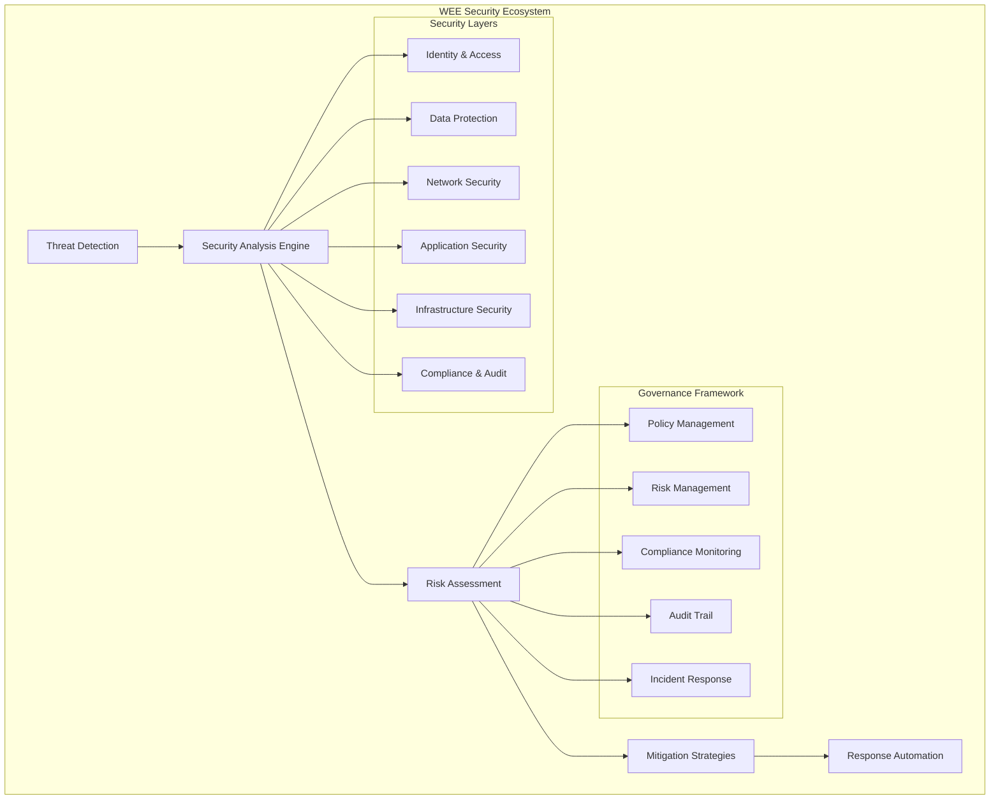

# WEE Security & Governance Framework

## 🕵️ Security Architecture by Sherlock (QA Agent)

*"Like Sherlock Holmes examining every detail of a crime scene for clues, this security framework systematically protects WEE's evolutionary ecosystem through comprehensive detection, prevention, and governance mechanisms."*

## Security Architecture Overview



---

## Core Security Framework

### 1. Identity and Access Management (IAM)

#### 1.1 Adaptive Authentication System
```typescript
class WEEAuthenticationSystem {
  private authProvider: MultiFactorAuthProvider;
  private behaviorAnalyzer: UserBehaviorAnalyzer;
  private riskAssessment: AuthenticationRiskAssessment;
  private sessionManager: AdaptiveSessionManager;
  
  // Adaptive multi-factor authentication
  async authenticateUser(credentials: UserCredentials, context: AuthContext): Promise<AuthResult> {
    // Analyze authentication context
    const contextRisk = await this.riskAssessment.assessContext(context);
    
    // Determine required authentication factors
    const requiredFactors = await this.determineRequiredFactors(contextRisk);
    
    // Validate credentials with adaptive security
    const validation = await this.authProvider.validateCredentials(credentials, requiredFactors);
    
    // Analyze user behavior patterns
    const behaviorAnalysis = await this.behaviorAnalyzer.analyzeBehavior(credentials.userId, context);
    
    // Create adaptive session
    const session = await this.sessionManager.createSession(validation, behaviorAnalysis);
    
    return new AuthResult(validation.success, session, behaviorAnalysis.riskScore);
  }
  
  // Behavioral anomaly detection
  async detectBehavioralAnomalies(userId: string, activity: UserActivity): Promise<AnomalyDetection> {
    // Establish user baseline behavior
    const baseline = await this.behaviorAnalyzer.getBaseline(userId);
    
    // Compare current activity to baseline
    const comparison = await this.behaviorAnalyzer.compareToBaseline(activity, baseline);
    
    // Detect anomalies using ML models
    const anomalies = await this.behaviorAnalyzer.detectAnomalies(comparison);
    
    // Assess anomaly severity
    const severity = await this.riskAssessment.assessAnomalySeverity(anomalies);
    
    return new AnomalyDetection(anomalies, severity, baseline);
  }
}
```

#### 1.2 Role-Based Access Control (RBAC)
```typescript
class WEERBACSystem {
  private roleManager: DynamicRoleManager;
  private permissionEngine: PermissionEngine;
  private accessPolicyEngine: AccessPolicyEngine;
  private auditLogger: AccessAuditLogger;
  
  // Dynamic role assignment
  async assignRole(userId: string, requestedRole: Role, context: AccessContext): Promise<RoleAssignment> {
    // Validate role assignment request
    const validation = await this.roleManager.validateRoleRequest(userId, requestedRole);
    
    // Check user qualifications for role
    const qualifications = await this.roleManager.checkQualifications(userId, requestedRole);
    
    // Assess context-specific requirements
    const contextRequirements = await this.accessPolicyEngine.getContextRequirements(context);
    
    // Create time-limited role assignment
    const assignment = await this.roleManager.createTimeBasedAssignment(
      userId, 
      requestedRole, 
      qualifications, 
      contextRequirements
    );
    
    // Log assignment for audit
    await this.auditLogger.logRoleAssignment(assignment);
    
    return assignment;
  }
  
  // Permission evaluation with context
  async evaluatePermission(userId: string, resource: Resource, action: Action, context: AccessContext): Promise<PermissionResult> {
    // Get user's current roles
    const userRoles = await this.roleManager.getUserRoles(userId);
    
    // Evaluate permissions for each role
    const rolePermissions = await Promise.all(
      userRoles.map(role => this.permissionEngine.evaluateRolePermission(role, resource, action))
    );
    
    // Apply context-specific policies
    const contextPolicies = await this.accessPolicyEngine.getContextPolicies(context);
    const policyResult = await this.accessPolicyEngine.evaluatePolicies(contextPolicies, rolePermissions);
    
    // Log access attempt
    await this.auditLogger.logAccessAttempt(userId, resource, action, policyResult);
    
    return new PermissionResult(policyResult.allowed, policyResult.reason, rolePermissions);
  }
}
```

### 2. Data Protection and Privacy

#### 2.1 Data Classification and Protection
```typescript
class WEEDataProtectionSystem {
  private dataClassifier: IntelligentDataClassifier;
  private encryptionManager: AdaptiveEncryptionManager;
  private dataLossPreventionEngine: DLPEngine;
  private privacyManager: PrivacyManager;
  
  // Intelligent data classification
  async classifyData(data: DataPayload): Promise<DataClassification> {
    // Analyze data content and structure
    const contentAnalysis = await this.dataClassifier.analyzeContent(data);
    
    // Detect sensitive data patterns
    const sensitivityAnalysis = await this.dataClassifier.analyzeSensitivity(data);
    
    // Apply ML-based classification
    const classification = await this.dataClassifier.classifyData(contentAnalysis, sensitivityAnalysis);
    
    // Determine protection requirements
    const protectionRequirements = await this.dataClassifier.determineProtection(classification);
    
    return new DataClassification(classification, protectionRequirements, sensitivityAnalysis);
  }
  
  // Adaptive encryption based on classification
  async applyAdaptiveEncryption(data: DataPayload, classification: DataClassification): Promise<EncryptedData> {
    // Select encryption algorithm based on classification
    const algorithm = await this.encryptionManager.selectAlgorithm(classification);
    
    // Generate context-specific keys
    const keys = await this.encryptionManager.generateKeys(algorithm, classification);
    
    // Apply encryption with data integrity protection
    const encrypted = await this.encryptionManager.encrypt(data, keys, algorithm);
    
    // Store encryption metadata securely
    await this.encryptionManager.storeMetadata(encrypted.id, keys, algorithm);
    
    return encrypted;
  }
  
  // Data loss prevention
  async preventDataLoss(data: DataPayload, context: TransferContext): Promise<DLPResult> {
    // Scan for sensitive data patterns
    const sensitiveData = await this.dataLossPreventionEngine.scanForSensitiveData(data);
    
    // Analyze transfer context for risks
    const contextRisk = await this.dataLossPreventionEngine.analyzeTransferContext(context);
    
    // Apply DLP policies
    const policyResult = await this.dataLossPreventionEngine.applyPolicies(sensitiveData, contextRisk);
    
    // Generate protection recommendations
    const recommendations = await this.dataLossPreventionEngine.generateRecommendations(policyResult);
    
    return new DLPResult(policyResult.allowed, recommendations, sensitiveData);
  }
}
```

#### 2.2 Privacy Management
```typescript
class WEEPrivacyManager {
  private consentManager: ConsentManager;
  private dataMinimizer: DataMinimizer;
  private anonymizationEngine: AnonymizationEngine;
  private retentionManager: DataRetentionManager;
  
  // Privacy-preserving data processing
  async processWithPrivacy(data: PersonalData, purpose: ProcessingPurpose): Promise<PrivacyResult> {
    // Verify consent for processing purpose
    const consent = await this.consentManager.verifyConsent(data.subjectId, purpose);
    
    if (!consent.isValid) {
      return new PrivacyResult(false, 'Invalid or missing consent', null);
    }
    
    // Apply data minimization
    const minimizedData = await this.dataMinimizer.minimize(data, purpose);
    
    // Apply anonymization if required
    const processedData = await this.anonymizationEngine.anonymize(minimizedData, purpose);
    
    // Set retention policy
    await this.retentionManager.setRetentionPolicy(processedData, purpose);
    
    return new PrivacyResult(true, 'Processing approved', processedData);
  }
  
  // GDPR compliance management
  async ensureGDPRCompliance(request: GDPRRequest): Promise<ComplianceResult> {
    switch (request.type) {
      case 'RIGHT_TO_ACCESS':
        return await this.handleDataAccessRequest(request);
      case 'RIGHT_TO_ERASURE':
        return await this.handleDataErasureRequest(request);
      case 'RIGHT_TO_PORTABILITY':
        return await this.handleDataPortabilityRequest(request);
      case 'RIGHT_TO_RECTIFICATION':
        return await this.handleDataRectificationRequest(request);
      default:
        return new ComplianceResult(false, 'Unsupported request type');
    }
  }
}
```

### 3. Network Security

#### 3.1 Network Threat Detection
```typescript
class WEENetworkSecurity {
  private trafficAnalyzer: NetworkTrafficAnalyzer;
  private intrusionDetector: IntrusionDetectionSystem;
  private firewallManager: IntelligentFirewallManager;
  private ddosProtection: DDoSProtectionSystem;
  
  // Real-time network threat detection
  async detectNetworkThreats(networkTraffic: NetworkTraffic): Promise<ThreatDetection> {
    // Analyze traffic patterns
    const trafficAnalysis = await this.trafficAnalyzer.analyzeTraffic(networkTraffic);
    
    // Detect intrusion attempts
    const intrusionAnalysis = await this.intrusionDetector.detectIntrusions(trafficAnalysis);
    
    // Identify DDoS patterns
    const ddosAnalysis = await this.ddosProtection.analyzeDDoSPatterns(trafficAnalysis);
    
    // Correlate threat indicators
    const correlatedThreats = await this.correlateThreats(intrusionAnalysis, ddosAnalysis);
    
    // Assess threat severity and impact
    const severity = await this.assessThreatSeverity(correlatedThreats);
    
    // Generate automated response recommendations
    const responseRecommendations = await this.generateResponseRecommendations(severity);
    
    return new ThreatDetection(correlatedThreats, severity, responseRecommendations);
  }
  
  // Adaptive firewall management
  async adaptiveFirewallManagement(threats: ThreatDetection): Promise<FirewallResponse> {
    // Analyze current firewall rules
    const currentRules = await this.firewallManager.getCurrentRules();
    
    // Generate adaptive rules based on threats
    const adaptiveRules = await this.firewallManager.generateAdaptiveRules(threats, currentRules);
    
    // Test rule effectiveness
    const ruleEffectiveness = await this.firewallManager.testRuleEffectiveness(adaptiveRules);
    
    // Apply rules with gradual rollout
    const deployment = await this.firewallManager.deployRulesGradually(adaptiveRules);
    
    return new FirewallResponse(adaptiveRules, ruleEffectiveness, deployment);
  }
}
```

#### 3.2 Secure Communication Protocols
```typescript
class WEESecureCommunication {
  private tlsManager: TLSManager;
  private certificateManager: CertificateManager;
  private vpnManager: VPNManager;
  private messageEncryption: MessageEncryptionService;
  
  // End-to-end encryption for communications
  async establishSecureChannel(participants: Participant[]): Promise<SecureChannel> {
    // Generate session keys for participants
    const sessionKeys = await this.messageEncryption.generateSessionKeys(participants);
    
    // Establish encrypted communication channel
    const channel = await this.messageEncryption.establishChannel(sessionKeys);
    
    // Implement perfect forward secrecy
    const pfsConfig = await this.messageEncryption.configurePFS(channel);
    
    // Set up key rotation schedule
    const keyRotation = await this.messageEncryption.scheduleKeyRotation(channel);
    
    return new SecureChannel(channel, pfsConfig, keyRotation);
  }
  
  // Certificate lifecycle management
  async manageCertificateLifecycle(): Promise<CertificateManagementResult> {
    // Monitor certificate expiration
    const expiringCerts = await this.certificateManager.getExpiringCertificates();
    
    // Auto-renew certificates before expiration
    const renewalResults = await Promise.all(
      expiringCerts.map(cert => this.certificateManager.autoRenew(cert))
    );
    
    // Validate certificate chains
    const validationResults = await this.certificateManager.validateCertificateChains();
    
    // Update certificate stores
    const updateResults = await this.certificateManager.updateCertificateStores();
    
    return new CertificateManagementResult(renewalResults, validationResults, updateResults);
  }
}
```

### 4. Application Security

#### 4.1 Code Security Analysis
```typescript
class WEEApplicationSecurity {
  private staticAnalyzer: StaticCodeAnalyzer;
  private dynamicAnalyzer: DynamicApplicationAnalyzer;
  private dependencyScanner: DependencySecurityScanner;
  private vulnerabilityManager: VulnerabilityManager;
  
  // Comprehensive security code analysis
  async analyzeCodeSecurity(codebase: Codebase): Promise<SecurityAnalysisResult> {
    // Static analysis for security vulnerabilities
    const staticAnalysis = await this.staticAnalyzer.analyzeCode(codebase);
    
    // Dynamic analysis during runtime
    const dynamicAnalysis = await this.dynamicAnalyzer.analyzeRuntime(codebase);
    
    // Dependency vulnerability scanning
    const dependencyAnalysis = await this.dependencyScanner.scanDependencies(codebase);
    
    // Correlate findings across analysis types
    const correlatedFindings = await this.correlateSecurityFindings(
      staticAnalysis, 
      dynamicAnalysis, 
      dependencyAnalysis
    );
    
    // Prioritize vulnerabilities by risk
    const prioritizedVulnerabilities = await this.vulnerabilityManager.prioritizeVulnerabilities(
      correlatedFindings
    );
    
    // Generate remediation recommendations
    const remediationPlan = await this.vulnerabilityManager.generateRemediationPlan(
      prioritizedVulnerabilities
    );
    
    return new SecurityAnalysisResult(correlatedFindings, prioritizedVulnerabilities, remediationPlan);
  }
  
  // Runtime application protection
  async protectRuntimeApplication(application: Application): Promise<RuntimeProtection> {
    // Deploy runtime application self-protection (RASP)
    const raspDeployment = await this.dynamicAnalyzer.deployRASP(application);
    
    // Configure behavioral monitoring
    const behaviorMonitoring = await this.dynamicAnalyzer.configureBehaviorMonitoring(application);
    
    // Set up attack detection and response
    const attackDetection = await this.dynamicAnalyzer.configureAttackDetection(application);
    
    // Implement adaptive security controls
    const adaptiveControls = await this.dynamicAnalyzer.implementAdaptiveControls(application);
    
    return new RuntimeProtection(raspDeployment, behaviorMonitoring, attackDetection, adaptiveControls);
  }
}
```

#### 4.2 API Security Framework
```typescript
class WEEAPISecurityFramework {
  private apiGateway: SecureAPIGateway;
  private rateLimiter: AdaptiveRateLimiter;
  private apiValidator: APIRequestValidator;
  private threatIntelligence: APIThreatIntelligence;
  
  // Comprehensive API security
  async secureAPIEndpoint(endpoint: APIEndpoint, securityRequirements: SecurityRequirements): Promise<SecuredEndpoint> {
    // Implement authentication and authorization
    const authConfig = await this.apiGateway.configureAuthentication(endpoint, securityRequirements);
    
    // Set up adaptive rate limiting
    const rateLimitConfig = await this.rateLimiter.configureRateLimiting(endpoint);
    
    // Configure request validation
    const validationConfig = await this.apiValidator.configureValidation(endpoint);
    
    // Implement threat detection
    const threatDetection = await this.threatIntelligence.configureThreatDetection(endpoint);
    
    // Deploy security monitoring
    const monitoring = await this.apiGateway.deploySecurityMonitoring(endpoint);
    
    return new SecuredEndpoint(endpoint, authConfig, rateLimitConfig, validationConfig, threatDetection, monitoring);
  }
  
  // API abuse detection and prevention
  async detectAPIAbuse(apiTraffic: APITraffic): Promise<AbuseDetection> {
    // Analyze traffic patterns for abuse indicators
    const abusePatterns = await this.threatIntelligence.analyzeAbusePatterns(apiTraffic);
    
    // Detect automated attacks
    const automatedAttacks = await this.threatIntelligence.detectAutomatedAttacks(apiTraffic);
    
    // Identify credential stuffing attempts
    const credentialStuffing = await this.threatIntelligence.detectCredentialStuffing(apiTraffic);
    
    // Generate abuse mitigation strategies
    const mitigationStrategies = await this.threatIntelligence.generateMitigationStrategies(
      abusePatterns, 
      automatedAttacks, 
      credentialStuffing
    );
    
    return new AbuseDetection(abusePatterns, automatedAttacks, credentialStuffing, mitigationStrategies);
  }
}
```

### 5. Infrastructure Security

#### 5.1 Container and Orchestration Security
```typescript
class WEEInfrastructureSecurity {
  private containerScanner: ContainerSecurityScanner;
  private orchestrationSecurity: OrchestrationSecurityManager;
  private infrastructureMonitor: InfrastructureSecurityMonitor;
  private configurationManager: SecureConfigurationManager;
  
  // Container security scanning and hardening
  async secureContainerEnvironment(containers: Container[]): Promise<ContainerSecurityResult> {
    // Scan container images for vulnerabilities
    const imageScans = await Promise.all(
      containers.map(container => this.containerScanner.scanImage(container.image))
    );
    
    // Analyze runtime security posture
    const runtimeAnalysis = await Promise.all(
      containers.map(container => this.containerScanner.analyzeRuntime(container))
    );
    
    // Implement security policies
    const securityPolicies = await this.orchestrationSecurity.implementSecurityPolicies(containers);
    
    // Configure network policies
    const networkPolicies = await this.orchestrationSecurity.configureNetworkPolicies(containers);
    
    // Set up runtime monitoring
    const runtimeMonitoring = await this.infrastructureMonitor.setupContainerMonitoring(containers);
    
    return new ContainerSecurityResult(imageScans, runtimeAnalysis, securityPolicies, networkPolicies, runtimeMonitoring);
  }
  
  // Infrastructure configuration security
  async secureInfrastructureConfiguration(infrastructure: Infrastructure): Promise<ConfigurationSecurityResult> {
    // Audit current configuration
    const configurationAudit = await this.configurationManager.auditConfiguration(infrastructure);
    
    // Apply security hardening
    const hardeningResults = await this.configurationManager.applyHardening(infrastructure);
    
    // Implement configuration drift detection
    const driftDetection = await this.configurationManager.setupDriftDetection(infrastructure);
    
    // Configure compliance monitoring
    const complianceMonitoring = await this.configurationManager.setupComplianceMonitoring(infrastructure);
    
    return new ConfigurationSecurityResult(configurationAudit, hardeningResults, driftDetection, complianceMonitoring);
  }
}
```

---

## Governance Framework

### 1. Policy Management System

#### 1.1 Dynamic Policy Engine
```typescript
class WEEPolicyEngine {
  private policyRepository: PolicyRepository;
  private policyEvaluator: PolicyEvaluator;
  private policyOptimizer: PolicyOptimizer;
  private conflictResolver: PolicyConflictResolver;
  
  // Dynamic policy creation and management
  async createAdaptivePolicy(requirements: PolicyRequirements): Promise<AdaptivePolicy> {
    // Analyze policy requirements
    const analysis = await this.policyEvaluator.analyzeRequirements(requirements);
    
    // Generate policy rules
    const rules = await this.policyEvaluator.generateRules(analysis);
    
    // Optimize policy for performance
    const optimizedRules = await this.policyOptimizer.optimizeRules(rules);
    
    // Check for conflicts with existing policies
    const conflicts = await this.conflictResolver.detectConflicts(optimizedRules);
    
    // Resolve conflicts automatically
    const resolvedRules = await this.conflictResolver.resolveConflicts(optimizedRules, conflicts);
    
    // Create adaptive policy
    const policy = new AdaptivePolicy(resolvedRules, analysis.context);
    
    // Store policy in repository
    await this.policyRepository.storePolicy(policy);
    
    return policy;
  }
  
  // Policy effectiveness monitoring
  async monitorPolicyEffectiveness(policy: AdaptivePolicy): Promise<PolicyEffectivenessReport> {
    // Collect policy execution metrics
    const executionMetrics = await this.policyEvaluator.getExecutionMetrics(policy);
    
    // Analyze policy impact
    const impactAnalysis = await this.policyEvaluator.analyzeImpact(policy, executionMetrics);
    
    // Identify optimization opportunities
    const optimizations = await this.policyOptimizer.identifyOptimizations(impactAnalysis);
    
    // Generate effectiveness report
    const report = new PolicyEffectivenessReport(policy, executionMetrics, impactAnalysis, optimizations);
    
    return report;
  }
}
```

### 2. Risk Management System

#### 2.1 Intelligent Risk Assessment
```typescript
class WEERiskManagement {
  private riskAnalyzer: IntelligentRiskAnalyzer;
  private threatIntelligence: ThreatIntelligenceService;
  private vulnerabilityAssessment: VulnerabilityAssessmentService;
  private riskMitigation: RiskMitigationEngine;
  
  // Comprehensive risk assessment
  async assessRisk(asset: Asset, context: RiskContext): Promise<RiskAssessment> {
    // Analyze asset vulnerabilities
    const vulnerabilities = await this.vulnerabilityAssessment.assessAsset(asset);
    
    // Gather threat intelligence
    const threats = await this.threatIntelligence.getThreatsForAsset(asset);
    
    // Calculate risk score using ML models
    const riskScore = await this.riskAnalyzer.calculateRiskScore(vulnerabilities, threats, context);
    
    // Identify attack vectors
    const attackVectors = await this.riskAnalyzer.identifyAttackVectors(vulnerabilities, threats);
    
    // Generate impact assessment
    const impactAssessment = await this.riskAnalyzer.assessImpact(asset, attackVectors);
    
    // Create comprehensive risk profile
    const riskProfile = new RiskProfile(asset, vulnerabilities, threats, riskScore, attackVectors, impactAssessment);
    
    return new RiskAssessment(riskProfile, context);
  }
  
  // Automated risk mitigation
  async mitigateRisk(riskAssessment: RiskAssessment): Promise<MitigationPlan> {
    // Generate mitigation strategies
    const strategies = await this.riskMitigation.generateStrategies(riskAssessment);
    
    // Prioritize mitigation actions
    const prioritizedActions = await this.riskMitigation.prioritizeActions(strategies);
    
    // Create implementation timeline
    const timeline = await this.riskMitigation.createTimeline(prioritizedActions);
    
    // Estimate resource requirements
    const resources = await this.riskMitigation.estimateResources(prioritizedActions);
    
    // Generate mitigation plan
    const plan = new MitigationPlan(prioritizedActions, timeline, resources);
    
    return plan;
  }
}
```

### 3. Compliance Monitoring

#### 3.1 Automated Compliance Framework
```typescript
class WEEComplianceFramework {
  private complianceEngine: ComplianceEngine;
  private regulatoryTracker: RegulatoryRequirementTracker;
  private evidenceCollector: EvidenceCollector;
  private complianceReporter: ComplianceReporter;
  
  // Multi-framework compliance monitoring
  async monitorCompliance(frameworks: ComplianceFramework[]): Promise<ComplianceStatus> {
    const complianceResults = await Promise.all(
      frameworks.map(async framework => {
        // Get current regulatory requirements
        const requirements = await this.regulatoryTracker.getRequirements(framework);
        
        // Assess compliance against requirements
        const assessment = await this.complianceEngine.assessCompliance(framework, requirements);
        
        // Collect supporting evidence
        const evidence = await this.evidenceCollector.collectEvidence(framework, requirements);
        
        // Identify compliance gaps
        const gaps = await this.complianceEngine.identifyGaps(assessment);
        
        return {
          framework,
          assessment,
          evidence,
          gaps
        };
      })
    );
    
    // Generate overall compliance status
    const overallStatus = await this.complianceEngine.generateOverallStatus(complianceResults);
    
    return new ComplianceStatus(overallStatus, complianceResults);
  }
  
  // Automated compliance reporting
  async generateComplianceReport(frameworks: ComplianceFramework[], period: TimePeriod): Promise<ComplianceReport> {
    // Collect compliance data for period
    const complianceData = await this.complianceEngine.getComplianceData(frameworks, period);
    
    // Generate framework-specific reports
    const frameworkReports = await Promise.all(
      frameworks.map(framework => this.complianceReporter.generateFrameworkReport(framework, complianceData))
    );
    
    // Create executive summary
    const executiveSummary = await this.complianceReporter.generateExecutiveSummary(frameworkReports);
    
    // Generate recommendations
    const recommendations = await this.complianceReporter.generateRecommendations(frameworkReports);
    
    return new ComplianceReport(executiveSummary, frameworkReports, recommendations, period);
  }
}
```

### 4. Audit Trail and Monitoring

#### 4.1 Comprehensive Audit System
```typescript
class WEEAuditSystem {
  private auditLogger: TamperProofAuditLogger;
  private eventCorrelator: SecurityEventCorrelator;
  private forensicsEngine: DigitalForensicsEngine;
  private alertManager: SecurityAlertManager;
  
  // Tamper-proof audit logging
  async logSecurityEvent(event: SecurityEvent): Promise<AuditLogEntry> {
    // Create tamper-proof log entry
    const entry = await this.auditLogger.createLogEntry(event);
    
    // Add cryptographic integrity protection
    const protectedEntry = await this.auditLogger.addIntegrityProtection(entry);
    
    // Store in immutable audit trail
    const stored = await this.auditLogger.storeImmutable(protectedEntry);
    
    // Correlate with other security events
    const correlations = await this.eventCorrelator.correlateEvent(stored);
    
    // Check for alert conditions
    await this.checkAlertConditions(stored, correlations);
    
    return stored;
  }
  
  // Digital forensics capabilities
  async conductForensicAnalysis(incident: SecurityIncident): Promise<ForensicAnalysisResult> {
    // Preserve digital evidence
    const evidence = await this.forensicsEngine.preserveEvidence(incident);
    
    // Reconstruct incident timeline
    const timeline = await this.forensicsEngine.reconstructTimeline(evidence);
    
    // Analyze attack patterns
    const attackAnalysis = await this.forensicsEngine.analyzeAttackPatterns(evidence);
    
    // Identify indicators of compromise
    const iocs = await this.forensicsEngine.identifyIOCs(evidence);
    
    // Generate forensic report
    const report = await this.forensicsEngine.generateReport(evidence, timeline, attackAnalysis, iocs);
    
    return new ForensicAnalysisResult(evidence, timeline, attackAnalysis, iocs, report);
  }
}
```

### 5. Incident Response Framework

#### 5.1 Automated Incident Response
```typescript
class WEEIncidentResponse {
  private incidentDetector: IncidentDetector;
  private responseOrchestrator: ResponseOrchestrator;
  private containmentEngine: ContainmentEngine;
  private recoveryManager: RecoveryManager;
  
  // Automated incident detection and response
  async detectAndRespond(securityEvent: SecurityEvent): Promise<IncidentResponse> {
    // Detect if event constitutes an incident
    const incident = await this.incidentDetector.analyzeEvent(securityEvent);
    
    if (!incident.isIncident) {
      return new IncidentResponse(false, 'Event does not constitute an incident');
    }
    
    // Classify incident severity and type
    const classification = await this.incidentDetector.classifyIncident(incident);
    
    // Orchestrate automated response
    const response = await this.responseOrchestrator.orchestrateResponse(classification);
    
    // Execute containment measures
    const containment = await this.containmentEngine.executeContainment(incident, response);
    
    // Begin recovery process
    const recovery = await this.recoveryManager.initiateRecovery(incident, containment);
    
    // Generate incident report
    const report = await this.generateIncidentReport(incident, response, containment, recovery);
    
    return new IncidentResponse(true, 'Incident response executed', report);
  }
  
  // Continuous improvement of incident response
  async improveResponseCapabilities(pastIncidents: SecurityIncident[]): Promise<ImprovementPlan> {
    // Analyze response effectiveness
    const effectiveness = await this.responseOrchestrator.analyzeEffectiveness(pastIncidents);
    
    // Identify improvement opportunities
    const opportunities = await this.responseOrchestrator.identifyImprovements(effectiveness);
    
    // Generate improvement recommendations
    const recommendations = await this.responseOrchestrator.generateRecommendations(opportunities);
    
    // Create implementation plan
    const plan = await this.responseOrchestrator.createImplementationPlan(recommendations);
    
    return new ImprovementPlan(opportunities, recommendations, plan);
  }
}
```

---

## Security Metrics and KPIs

### 1. Security Performance Indicators
```yaml
security_kpis:
  threat_detection_metrics:
    - detection_accuracy: ">95%"
    - false_positive_rate: "<5%"
    - mean_time_to_detection: "<15 minutes"
    - threat_coverage: ">90%"
    
  incident_response_metrics:
    - mean_time_to_response: "<30 minutes"
    - containment_effectiveness: ">95%"
    - recovery_time_objective: "<4 hours"
    - incident_recurrence_rate: "<2%"
    
  compliance_metrics:
    - compliance_score: ">95%"
    - audit_findings: "<5 per audit"
    - remediation_time: "<30 days"
    - policy_adherence: ">98%"
    
  vulnerability_management_metrics:
    - vulnerability_discovery_rate: "continuous"
    - time_to_patch_critical: "<24 hours"
    - vulnerability_coverage: ">98%"
    - risk_reduction_rate: ">80%"
```

### 2. Security Dashboard Framework
```typescript
interface SecurityDashboard {
  // Real-time threat monitoring
  threatMonitoring: {
    activeThreatCount: RealTimeMetric;
    threatSeverityDistribution: PieChart;
    attackVectorTrends: TrendChart;
    geoLocationThreats: MapVisualization;
  };
  
  // Compliance status overview
  complianceOverview: {
    overallComplianceScore: ScoreWidget;
    frameworkCompliance: ComplianceMatrix;
    auditFindings: FindingsChart;
    remediationProgress: ProgressChart;
  };
  
  // Security operations metrics
  securityOperations: {
    incidentVolume: VolumeChart;
    responseMetrics: PerformanceChart;
    alertFatigue: FatigueIndicator;
    teamEfficiency: EfficiencyChart;
  };
  
  // Risk assessment overview
  riskOverview: {
    riskHeatMap: HeatMapVisualization;
    topRisks: RiskList;
    riskTrends: TrendAnalysis;
    mitigationProgress: ProgressTracking;
  };
}
```

---

## 🕵️ Sherlock's Security Summary

*"Like Holmes analyzing every clue with methodical precision, this security framework provides comprehensive protection through systematic detection, prevention, and response mechanisms. Every security control is designed to evolve and adapt, ensuring WEE's evolutionary ecosystem remains secure as it grows."*

**Key Security Achievements:**
1. **Adaptive Security**: Security controls that evolve with emerging threats
2. **Zero-Trust Architecture**: Continuous verification and validation
3. **Automated Response**: Rapid detection and mitigation of security incidents
4. **Comprehensive Compliance**: Multi-framework compliance monitoring
5. **Privacy by Design**: Built-in privacy protection and data minimization
6. **Forensic Capabilities**: Complete digital forensics and incident investigation
7. **Continuous Improvement**: Learning from security events to enhance protection

This security framework ensures WEE's evolutionary capabilities are protected by equally adaptive and intelligent security measures, creating a resilient ecosystem that grows stronger with every security challenge.