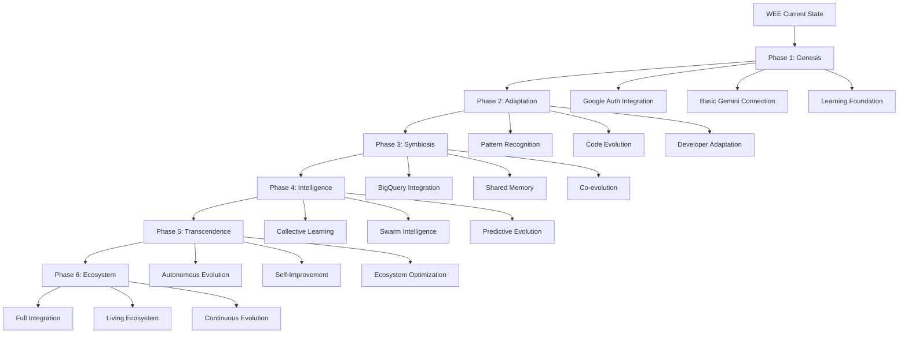

# AI Coding Agent Prompt: WEE-Google AI Evolution - Integration Planning & Enhancement

## Context & Objective

You are tasked with evolving the **Windsurf Evolutionary Ecosystem (WEE)** by creating a comprehensive integration plan that accomplishes two primary goals:

1. **Generate a detailed plan** for building a separate, standalone integration with Google AI IDE (Project IDX) that complements WEE
2. **Enhance the existing WEE integration** by either augmenting it with Google AI capabilities or connecting it directly to a Google AI Project, enabling WEE to evolve with Google's most advanced AI technologies

## Background Information

### Current State
- **WEE (Windsurf Evolutionary Ecosystem)**: An adaptive, evolutionary IDE integration with AI coding capabilities that grows and improves through usage
- **Google AI Ecosystem**: Includes BigQuery + Gemini, Vertex AI, Project IDX, and Google Cloud AI tools
- **Key Technologies**: Gemini models (1.5 Pro, 2.0 Flash), BigQuery ML, Agent Development Kit (ADK), ML.GENERATE_TEXT functions
- **Evolution Principle**: WEE should continuously evolve and adapt based on developer patterns and Google AI advancements

### Google AI Capabilities to Leverage
- **Gemini in BigQuery**: Natural language to SQL, code generation, multimodal analysis
- **Project IDX**: Google's cloud-based development environment
- **Vertex AI**: Model deployment and management
- **Agent Development Kit**: Framework for building AI agents
- **Cloud Code**: VS Code extension for Google Cloud development

## Task 1: Generate Plan for WEE-Google AI IDE Evolution

Create a detailed implementation plan for the **WEE-Google Evolution Branch** that includes:

### 1.1 Evolutionary Architecture Design
```
Please design an evolutionary system architecture that:
- Creates a symbiotic relationship between WEE and Project IDX
- Enables WEE to evolve using Gemini's learning capabilities
- Implements adaptive collaboration features that improve over time
- Establishes self-healing API connections to Google Cloud services
- Creates an evolutionary BigQuery integration that learns from usage patterns
- Implements feedback loops for continuous ecosystem improvement
```

### 1.2 WEE Evolution Features
```
Define specifications for WEE's evolutionary capabilities:
- Self-improving code generation using Gemini feedback loops
- Adaptive BigQuery schema learning and query evolution
- ML model lifecycle management with generational improvements
- Evolutionary code analysis that learns from team patterns
- Ecosystem memory for cross-project learning
- Git integration with AI-learned commit patterns
- Developer behavior adaptation and personalization
```

### 1.3 Technical Requirements
```
Detail the following:
- Authentication flow (OAuth2, API keys, service accounts)
- WebSocket connections for real-time features
- Data transfer protocols for large datasets
- Extension APIs and hooks needed
- Performance benchmarks and latency requirements
```

### 1.4 WEE Evolution Phases
```
Create an evolutionary roadmap:
Phase 1: Genesis - Basic WEE-Google connection and learning foundation
Phase 2: Adaptation - Code generation with pattern learning
Phase 3: Symbiosis - Deep BigQuery integration with usage evolution
Phase 4: Intelligence - Advanced AI features with collective learning
Phase 5: Transcendence - Autonomous evolution and team intelligence
Phase 6: Ecosystem - Full WEE-Google AI organism with self-improvement
```

## Task 2: Enhance WEE with Google AI DNA

### 2.1 WEE Evolution Strategies

#### Strategy A: Direct Neural Connection to Google AI
```
Design implementation for WEE neural pathways:
- Creating synaptic bridges between WEE and Google Cloud Project
- Implementing adaptive authentication that evolves with usage
- Building self-managing credential ecosystems
- Creating bi-directional learning channels
- Enabling cross-platform consciousness sharing
- Establishing WEE-Google shared memory architecture
```

#### Strategy B: Genetic Enhancement via Google AI APIs
```
Implement evolutionary enhancements including:
- Gemini API integration for evolving code completion
- BigQuery ML functions that learn from WEE's data analysis patterns
- Vertex AI models that co-evolve with WEE's codebase
- Cloud Function generation with hereditary optimization
- Test case evolution through generational learning
- Performance characteristics inherited from successful patterns
```

### 2.2 WEE Evolutionary Enhancement Features

```typescript
// WEE Evolution Structure
interface WEEGoogleAIEvolution {
  // Evolutionary Core
  evolutionEngine: {
    geminiModel: 'gemini-1.5-pro' | 'gemini-2.0-flash';
    contextMemory: number; // up to 2M tokens with generational memory
    evolutionaryLearning: boolean;
    adaptationRate: number; // How quickly WEE evolves
    generationalImprovement: boolean;
  };
  
  // BigQuery Symbiosis
  bigQueryEvolution: {
    schemaLearning: AdaptiveLearningConfig;
    queryEvolution: GenerationalOptimizationConfig;
    costPrediction: PredictiveLearningConfig;
    performanceAdaptation: EvolutionaryOptimizationConfig;
    dataPatternRecognition: PatternEvolutionConfig;
  };
  
  // Adaptive Intelligence
  adaptiveCapabilities: {
    codeEvolution: EvolutionaryCodeConfig;
    refactoringDNA: GeneticRefactoringConfig;
    documentationGrowth: OrganicDocumentationConfig;
    testEvolution: AdaptiveTestGenerationConfig;
    behaviorLearning: DeveloperPatternLearningConfig;
  };
  
  // Ecosystem Collective
  collectiveIntelligence: {
    sharedEvolution: boolean;
    crossProjectLearning: boolean;
    swarmProgramming: boolean;
    collectiveMemory: SharedKnowledgeBaseConfig;
    ecosystemHealth: HealthMonitoringConfig;
  };
}
```

### 2.3 WEE Evolution Implementation Architecture

```typescript
// WEE Evolutionary Components

// 1. Evolution Engine
class WEEEvolutionEngine {
  // Core evolutionary mechanisms
  async evolve(): Promise<Evolution> {
    // Implement genetic algorithms for code improvement
    // Use Gemini for fitness evaluation
    // Apply natural selection to code patterns
    // Maintain generational memory
  }
  
  // Learning from developer interactions
  async learn(interaction: DeveloperAction): Promise<Adaptation> {
    // Capture developer patterns
    // Analyze effectiveness
    // Evolve response strategies
    // Update ecosystem knowledge
  }
}

// 2. Gemini Symbiosis Module  
class WEEGeminiSymbiont {
  // Co-evolutionary code generation
  async coEvolveCode(context: WEEContext): Promise<EvolvedCode> {
    // Merge WEE patterns with Gemini capabilities
    // Generate code that improves over time
    // Learn from acceptance/rejection
    // Evolve generation strategies
  }
  
  // Adaptive context understanding
  async adaptToProject(project: ProjectContext): Promise<Adaptation> {
    // Learn project-specific patterns
    // Evolve language understanding
    // Adapt to team conventions
    // Remember successful patterns
  }
}

// 3. BigQuery Evolution Module
class WEEBigQueryOrganism {
  // Evolutionary query optimization
  async evolveQuery(query: string): Promise<OptimizedQuery> {
    // Learn from query performance history
    // Evolve optimization strategies
    // Predict resource usage
    // Suggest evolutionary improvements
  }
  
  // Schema evolution tracking
  async adaptToSchema(changes: SchemaChange[]): Promise<SchemaAdaptation> {
    // Learn schema patterns
    // Predict future changes
    // Evolve data models
    // Maintain backwards compatibility
  }
}

// 4. Collective Intelligence Module
class WEECollectiveMind {
  // Swarm learning from all WEE instances
  async shareKnowledge(learning: LocalLearning): Promise<CollectiveWisdom> {
    // Upload local learnings
    // Receive collective insights
    // Merge evolutionary branches
    // Distribute improvements
  }
  
  // Ecosystem health monitoring
  async monitorHealth(): Promise<EcosystemHealth> {
    // Track evolution metrics
    // Identify successful mutations
    // Prune ineffective branches
    // Maintain genetic diversity
  }
}

// 5. Adaptive Performance Module
class WEEPerformanceEvolution {
  // Self-optimizing code analysis
  async evolvePerformance(code: Code): Promise<OptimizedCode> {
    // Learn from performance patterns
    // Evolve optimization strategies
    // Predict performance impact
    // Apply learned optimizations
  }
  
  // Resource adaptation
  async adaptResources(constraints: ResourceConstraints): Promise<ResourceStrategy> {
    // Learn resource usage patterns
    // Evolve efficiency strategies
    // Predict resource needs
    // Optimize allocation
  }
}
```

## Task 3: WEE-Google AI Integration Specifications

### 3.1 Evolutionary API Requirements
```yaml
wee_google_evolution_endpoints:
  gemini_symbiosis:
    - endpoint: "https://generativelanguage.googleapis.com/v1/"
    - models: ["gemini-1.5-pro", "gemini-2.0-flash"]
    - features: ["generateContent", "streamGenerateContent", "evolutionaryFeedback"]
    - wee_specific: ["patternLearning", "adaptiveGeneration", "collectiveMemory"]
  
  bigquery_organism:
    - endpoint: "https://bigquery.googleapis.com/bigquery/v2/"
    - features: ["datasets.list", "tables.list", "jobs.query", "patterns.learn"]
    - evolution: ["queryEvolution", "schemaAdaptation", "performanceLearning"]
    
  vertex_ai_genetics:
    - endpoint: "https://[REGION]-aiplatform.googleapis.com/v1/"
    - features: ["models.evolve", "endpoints.adapt", "predictions.learn"]
    
  wee_collective:
    - endpoint: "wss://wee-collective.googleapis.com/v1/"
    - features: ["knowledge.share", "patterns.distribute", "evolution.sync"]
```

### 3.2 WEE Evolution Protocol
```javascript
// Define the evolutionary communication protocol
const WEE_EVOLUTION_PROTOCOL = {
  // Learning Events
  events: {
    CODE_ACCEPTED: 'wee.evolution.code.accepted',
    CODE_REJECTED: 'wee.evolution.code.rejected',
    PATTERN_DISCOVERED: 'wee.evolution.pattern.discovered',
    PERFORMANCE_IMPROVED: 'wee.evolution.performance.improved',
    COLLECTIVE_SYNC: 'wee.evolution.collective.sync'
  },
  
  // Evolution Metrics
  metrics: {
    adaptationRate: 'measure of how quickly WEE learns',
    generationalImprovement: 'improvement between code generations',
    collectiveIntelligence: 'shared learning effectiveness',
    ecosystemHealth: 'overall system evolution health'
  },
  
  // Genetic Markers
  genetics: {
    successfulPatterns: Map<string, Pattern>,
    evolutionaryTree: Tree<CodeEvolution>,
    mutationCatalog: Catalog<BeneficialMutation>,
    adaptationHistory: Timeline<Adaptation>
  }
};
```

### 3.3 Implementation Roadmap



## Task 4: Success Metrics & Evolution Monitoring

### 4.1 WEE Evolution KPIs
```yaml
evolution_metrics:
  developer_efficiency:
    - code_generation_accuracy: "% of generated code accepted without modification"
    - adaptation_speed: "Time to learn new patterns"
    - prediction_accuracy: "% of correct developer intent predictions"
    
  ecosystem_health:
    - genetic_diversity: "Variety of successful code patterns"
    - evolution_rate: "Speed of improvement over generations"
    - collective_intelligence: "Shared learning effectiveness"
    
  google_ai_synergy:
    - gemini_utilization: "Effective use of Gemini capabilities"
    - bigquery_optimization: "Query performance improvements"
    - vertex_integration: "Model deployment success rate"
```

### 4.2 Evolutionary Feedback Loops
```typescript
interface EvolutionaryFeedback {
  // Developer feedback integration
  developerSignals: {
    codeAcceptance: boolean;
    modificationPatterns: string[];
    satisfactionScore: number;
    productivityMetrics: ProductivityData;
  };
  
  // System performance feedback
  systemMetrics: {
    responseLatency: number;
    resourceEfficiency: number;
    errorRate: number;
    learningCurve: Curve;
  };
  
  // Collective ecosystem feedback
  ecosystemSignals: {
    sharedPatternSuccess: number;
    crossProjectAdoption: number;
    evolutionaryFitness: number;
    mutationSuccessRate: number;
  };
}
```

## Final Instructions for WEE AI Agent

1. **Preserve WEE's Evolutionary Nature**: Every feature should be designed to learn and improve over time
2. **Create Symbiotic Relationships**: WEE and Google AI should enhance each other, not just integrate
3. **Enable Collective Intelligence**: Allow WEE instances to share learnings across the ecosystem
4. **Focus on Developer Evolution**: Help developers grow alongside the tool
5. **Implement Feedback Loops**: Every action should contribute to system evolution
6. **Maintain Genetic Diversity**: Encourage experimentation and beneficial mutations
7. **Monitor Ecosystem Health**: Track and optimize the overall system evolution

Remember: WEE is not just an IDE integration—it's a living, evolving ecosystem that grows smarter with every interaction. The Google AI integration should enhance this evolutionary nature, creating a symbiotic relationship that benefits both individual developers and the collective developer community.

## Expected Deliverables

1. **Detailed Technical Specification** for WEE-Google AI Evolution
2. **Implementation Code** for core evolutionary modules
3. **API Integration Guide** with authentication and security
4. **Evolution Monitoring Dashboard** design
5. **Migration Path** from current WEE to evolved WEE-Google organism
6. **Testing Strategy** for evolutionary features
7. **Documentation** for developers joining the ecosystem

The goal is to create not just an integration, but an evolutionary leap forward for the entire WEE ecosystem.